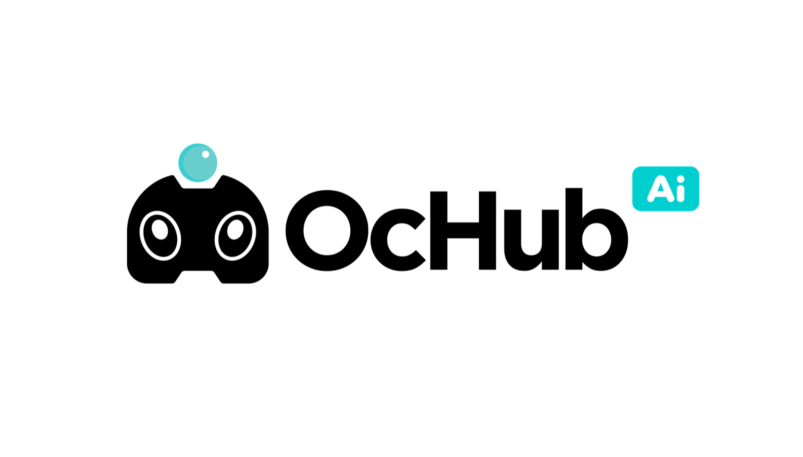

<p align="center">
  <picture>
    <source media="(prefers-color-scheme: dark)" srcset="docs/assets/ochub-wordmark-light.png">
    
  </picture>
</p>

<p align="center">
  English · <a href="README.zh-CN.md">简体中文</a>
</p>

<p align="center">
  <strong>One native control center for your AI coding tools.</strong>
</p>

<p align="center">
  Connect providers, switch models, share MCP servers and skills,<br>
  and route every supported client through one local gateway.
</p>

<p align="center">
  <a href="https://github.com/OcHub-team/OcHub/releases/latest"><strong>Download OcHub</strong></a>
  ·
  <a href="#why-ochub">Why OcHub</a>
  ·
  <a href="#install">Install</a>
  ·
  <a href="#build-from-source">Build from source</a>
</p>

<p align="center">
  <a href="https://github.com/OcHub-team/OcHub/actions/workflows/ci.yml"></a>
  <a href="https://github.com/OcHub-team/OcHub/releases/latest"></a>
  <a href="LICENSE"></a>
  
</p>

---

## Why OcHub

AI coding tools are powerful, but each one keeps its providers, MCP servers,
skills, sessions, and usage data in a different place. Changing an API endpoint
or sharing the same setup across several clients quickly turns into repeated
config-file editing.

OcHub brings that work into one fast, native desktop app. Use it as a simple
connection switcher, or place its local gateway between your tools and upstream
APIs for centralized routing, compatibility conversion, failover, and usage
tracking.

OcHub currently manages **Claude Code, Claude Desktop, Codex, Cherry Studio,
Grok Build, Kimi Code, OpenCode, OpenClaw, and Hermes**.

## Everything in one place

| | Capability | What it gives you |
| --- | --- | --- |
| 🔌 | **Connection management** | Discover, import, edit, test, and switch direct API connections without hand-editing client configs |
| ↗️ | **Model providers** | Give multiple clients one local endpoint, then control upstreams and routing centrally |
| 🔀 | **Smart routing** | Map model names and reasoning levels, retry compatible interfaces, switch to backup providers, and monitor health |
| 🧩 | **MCP & skills** | Keep reusable MCP servers and skills together, then distribute them to the tools that need them |
| 📊 | **Sessions & usage** | Browse local CLI sessions and understand tokens, cache, latency, requests, and estimated cost |
| 🔄 | **Sync & backup** | Protect your setup with snapshots and keep OcHub data in sync through supported remote storage |
| 🖥️ | **Remote nodes** | Switch existing providers on WSL, development machines, and headless servers securely over SSH |
| ⚡ | **Native Codex modes** | On macOS, launch Codex from OcHub and use Fast or Ultra directly in its native model picker with compatible models and upstreams |
| 🌙 | **Kimi Code profiles** | Manage native providers, model aliases, limits, capabilities, headers, and credential mappings in `~/.kimi-code/config.toml` |
| 🍒 | **Cherry Studio import** | Save reusable provider connections in OcHub, then open Cherry Studio's public Deep Link and confirm the import in-app |

## Two ways to connect

### Direct connection

Choose a tool, add an API connection, test it, and switch. OcHub writes the
client's native configuration, so the tool keeps working normally after OcHub
is closed.

**Best for:** a straightforward endpoint change, a tool's official login, or a
small setup with independent connections.

### Model provider mode

Point supported clients at OcHub's loopback gateway. The gateway can translate
between supported API dialects and apply model aliases, reasoning mappings,
interface retries, health checks, and failover before a request reaches its
upstream.

**Best for:** sharing an upstream across tools, normalizing model names,
converting API formats, tracking usage centrally, or building a resilient
multi-provider setup.

### Native Codex Fast and Ultra launcher

On macOS, the Codex app page includes **Launch Codex**. It starts a separate
Codex desktop instance and unlocks Fast and Ultra in the app's native model
picker for compatible GPT-5.6 models. OcHub intercepts the renderer script in
memory over a loopback-only debugging connection; it does not modify or re-sign
the installed Codex application.

This makes the native controls selectable and preserves the selected Fast
service tier in Codex requests. The configured model provider must still
support the requested service tier and reasoning effort. Launch Codex through
OcHub each time you need the unlock. See the
[advanced Codex guide](https://docs.ochub.org/codex/advanced#launch-codex-with-native-fast-and-ultra)
for supported models, security boundaries, and troubleshooting.

## Built for the desktop

- **Native UI** powered by GPUI — no browser shell or webview
- **Local-first storage** in `~/.ochub/`
- **Cross-platform releases** for macOS, Windows, and Linux
- **In-app updates** for DMG, Windows installer, and AppImage installations
- **Open source** under GPL-3.0-or-later

> [!IMPORTANT]
> OcHub is under active pre-release development. Back up important tool
> configuration before trying an early build. OcHub only changes the live
> configuration of applications you explicitly manage.

## Install

### Homebrew

Homebrew automatically selects the correct Apple Silicon or Intel build:

```sh
brew install --cask ochub-team/tap/ochub
```

OcHub is not yet notarized by Apple. If macOS blocks the first launch, open
**System Settings → Privacy & Security** and choose **Open Anyway**, or install
without the quarantine flag:

```sh
brew install --cask --no-quarantine ochub-team/tap/ochub
```

### Direct download

Download the latest release for your platform from the
**[GitHub Releases page](https://github.com/OcHub-team/OcHub/releases/latest)**.

| Platform | Available packages |
| --- | --- |
| macOS | Apple Silicon and Intel `.dmg`; headless CLI `.tar.gz` |
| Windows 10/11 x64 | NSIS installer, portable GUI `.zip`, and headless CLI `.zip` |
| Linux x64 | AppImage, Debian `.deb`, and headless CLI `.tar.gz` |

Releases include `SHA256SUMS` and a GitHub artifact attestation. Packaging,
signature verification, and release details live in the
[release guide](packaging/README.md).

The headless archives contain a single self-managing `ochcli` executable. See the included README
or run `ochcli --help` to configure and operate OcHub without the desktop GUI.
To control WSL or a development machine from OcHub Desktop, follow the
[Remote Nodes guide](https://docs.ochub.org/guides/remote-nodes).

## Build from source

OcHub is a Rust workspace built with GPUI and axum. The repository pins its
Rust toolchain, so rustup will select the correct version automatically.

```sh
git clone https://github.com/OcHub-team/OcHub.git
cd OcHub
cargo run -p ochub-app
```

Platform requirements:

- **macOS:** Xcode or Xcode Command Line Tools
- **Windows:** Visual Studio 2022 Build Tools with the Windows SDK
- **Debian/Ubuntu:** `./scripts/ci/install-linux-deps.sh`

Common development commands:

```sh
just check
just test
just ci
just qa-app       # macOS: builds /tmp/OCHUB-QA.app for acceptance testing
```

The workspace is split into these main components:

| Crate | Responsibility |
| --- | --- |
| `ochub-core` | Domain model, SQLite storage, client config, sync, MCP, skills, sessions, usage, and auth |
| `ochub-convert` | Request and response conversion between supported API dialects |
| `ochub-app` | Native GPUI desktop application |
| `ochcli` | Headless command-line interface |

## License

OcHub is licensed under the
[GNU General Public License v3.0 or later](LICENSE).

OcHub draws inspiration from
[`cc-switch`](https://github.com/farion1231/cc-switch) and
[`new-api`](https://github.com/QuantumNous/new-api).
