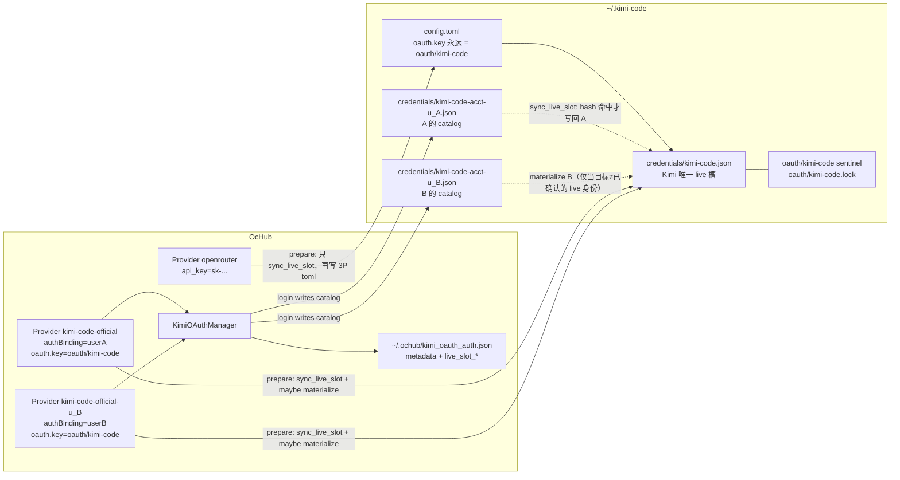
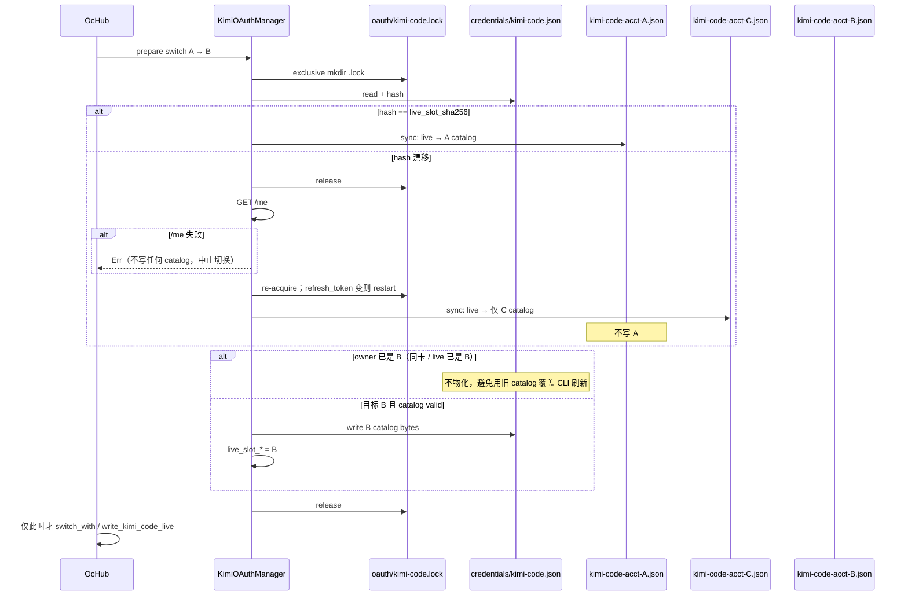
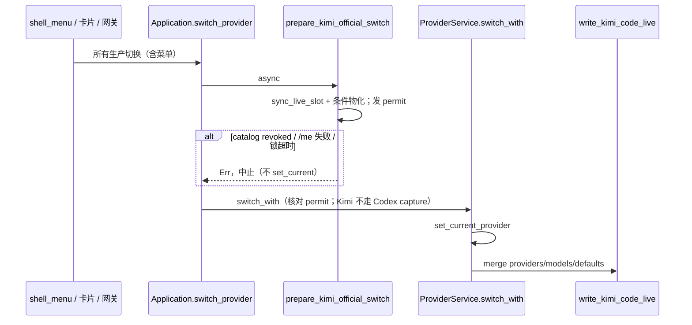

# Kimi Code 多 OAuth 账号切换

> **Superseded (2026-08-17)**  
> 本文已被 [`official-cli-credential-vault.md`](official-cli-credential-vault.md) 取代。  
> 新方案：**不在 OcHub 登录**；用户在 CLI 完成 `claude /login` / `kimi login`，OcHub 只做官方凭据的 capture / restore。  
> 不要按本文实现 Device Code / `ochcli auth kimi login` / GPUI 登录。


| 字段 | 值 |
|---|---|
| 作者 | OcHub design (draft) |
| 日期 | 2026-08-17 |
| 状态 | Draft |
| 读者 | OcHub 资深工程师 |
| 范围 | OcHub 桌面端 / `ochcli` / `ochub-core`；不改 Kimi Code 运行时 |

---

## Overview

OcHub 已经能用 **Provider 卡片** 在 Claude Official（空 `env`，CLI 自管凭据）和 Codex Official（每张卡一份 `auth.json` 快照 + `CodexOAuthManager` + `meta.authBinding`）之间切换。Kimi Code 还做不到：官方种子 `kimi-code-official` 只把 live `config.toml` 指回固定槽 `oauth/kimi-code` → `~/.kimi-code/credentials/kimi-code.json`，OcHub 既不能登录第二个 Kimi 账号，切走 3P 再切回也不会恢复「刚才那个」账号。

本方案让 **一张 OcHub Provider 卡片对应一个 Kimi OAuth 账号**。登录 / 刷新 / 登出在 OcHub 内完成（不必为多账号去跑 `kimi login`）；已有的 `kimi login` 会话作为一次性导入。

**硬约束（Kimi 运行时，不可绕过）**：生产环境 `(auth.kimi.com, api.kimi.com/coding/v1)` 的凭据槽是函数，不是自由指针。`resolveKimiCodeRuntimeAuth` 会把任何不等于期望值的 `oauth.key`（包括 `oauth/kimi-code-acct-*`）静默拨回 `oauth/kimi-code`。因此 **Kimi CLI 永远只读 `credentials/kimi-code.json`**。在不改 Kimi 的前提下，切换账号 = 在 Kimi 的 `proper-lockfile` 协议下把选定账号 **物化进这个唯一 live 槽**，并把槽里被 CLI 刷新过的内容 **capture 回** 切走账号的 catalog 文件。

账号目录复用 `managed_auth` + `authBinding`。官方 snapshot 的 `oauth.key` **始终**保持种子值 `oauth/kimi-code`。Token **不**进 SQLite。

---

## Background & Motivation

### 今天 OcHub 对 Kimi 做什么

Kimi 集成是 **聚焦 snapshot + `toml_edit` merge**，不是整文件覆盖：

- 读写：`crates/core/src/apps/kimi_code.rs` 的 `read_kimi_code_live_snapshot` / `write_kimi_code_live`
- 表单：`crates/core/src/provider_config/kimi_code.rs`（`api_key`，**没有 oauth 字段**；`encode()` 从 `prior_provider` 起步，已有 `oauth` 能活过编辑器保存）
- 模式：`AppMode::Switch`（`crates/core/src/plugin/builtin.rs`）
- 编辑器：`category == "official"` 时走「使用 Kimi Code 官方登录」（`uses_official_login`，`crates/app/src/provider_editor.rs`），只渲染文案，没有 Device Code UI
- 额度：`crates/core/src/services/subscription.rs` `read_kimi_credentials()` **写死** `credentials/kimi-code.json`，且 **不刷新**（文件头注释：「第一层：仅读取凭据，不实现登录/刷新」）。官方卡走 `query_usage` → `get_subscription_quota("kimi-code")`，**没有** provider / account 参数（和 Copilot 的 `managed_account_id_for` 不同）
- 网关导入：`resolve_usage_credentials` 读 snapshot 里的 `api_key`；官方卡是空串，已被拒绝（「该连接依赖应用官方登录」）

官方种子 `crates/core/src/db/dao/providers_seed.rs`：

```json
{
  "default_model": "kimi-code/k3",
  "providers": {
    "managed:kimi-code": {
      "type": "kimi",
      "api_key": "",
      "base_url": "https://api.kimi.com/coding/v1",
      "oauth": { "storage": "file", "key": "oauth/kimi-code" }
    }
  },
  "models": { "kimi-code/k3": { "provider": "managed:kimi-code", "model": "k3", ... } }
}
```

注释写明 token 住在 `credentials/kimi-code.json`，snapshot **不拥有** token。这是对的，必须保持。

`managed_auth` 今天只有 `github_copilot` 和 `codex_oauth`（`ensure_auth_provider`）。`map_account` 硬接到 `GitHubAccount`（Codex 已把 ChatGPT 用户假映射上去，`github_domain = "github.com"`）。GPUI **没有** Device Code 界面（Codex/Copilot 登录目前只在 `ochcli auth`）。

`AppState::bootstrap` 顺序是 **先** `auto_import_live_providers`，**后** `init_default_official_providers` / `init_official_quota_providers`。首次启动时 `import_default_config` 跑完时 `kimi-code-official` 行还不存在；若 DB 里只有官方种子（或为空），live 官方 OAuth 会被导成 id=`default`、`category="custom"`。

### Kimi Code OAuth 实际怎么工作

源码：`kimi-code/packages/oauth`。

| 项 | 值 |
|---|---|
| 流程 | RFC 8628 Device Code |
| Host | `https://auth.kimi.com`（`KIMI_CODE_OAUTH_HOST` / `KIMI_OAUTH_HOST`） |
| Client ID | `17e5f671-d194-4dfb-9706-5516cb48c098` |
| 授权 | `POST {oauthHost}/api/oauth/device_authorization`，**form-urlencoded** `{client_id}` |
| 换票 / 刷新 | `POST {oauthHost}/api/oauth/token`（`grant_type=urn:ietf:params:oauth:grant-type:device_code` / `refresh_token`），同样 form-urlencoded |
| 身份 | `GET https://api.kimi.com/coding/v1/me`（**不是 JWT claims**；`identity.ts` 只做 `X-Msh-*` 设备头） |
| 用量 | `GET {baseUrl}/usages` |
| 模型 | `GET {baseUrl}/models` |
| 默认 provider | `managed:kimi-code` |
| 默认 key | `oauth/kimi-code` → 文件名 `kimi-code.json`（`resolveKimiTokenStorageName` 去掉 `oauth/` 前缀） |
| 环境槽 | 非默认 `(oauthHost, baseUrl)` → `oauth/kimi-code-env-{sha256[:16]}` |
| 写盘 | `~/.kimi-code/credentials/<name>.json`，文件 `0600`，目录 `0700`，tmp+fsync+rename |
| 刷新锁 | 见下文「锁协议」；Windows / `KIMI_DISABLE_OAUTH_LOCK=1` 关闭 |
| 刷新阈值 | `max(300s, expires_in * 0.5)`；401/403/`invalid_grant` 写 tombstone |
| 运行时读 key | **`resolveKimiCodeRuntimeAuth` 按环境重算期望 key，配置里任何其它 key 都被丢弃** |

#### 期望 key 不是自由指针

`resolveKimiCodeOAuthKey`（`managed-kimi-code.ts`）只产出两类值：

- 默认生产对 `(https://auth.kimi.com, https://api.kimi.com/coding/v1)` → `oauth/kimi-code`
- 任何其它 `(oauthHost, baseUrl)` → `oauth/kimi-code-env-{sha256[:16]}`

`resolveKimiCodeRuntimeAuth`：

1. 有 `KIMI_CODE_BASE_URL` / `KIMI_CODE_OAUTH_HOST` / `KIMI_OAUTH_HOST` → 用环境槽
2. 否则若 `configured.key !== expected.key` → **返回 `expected`，丢掉配置的 key**
3. 否则才用配置的 key

chat、`/me`、usage、model refresh、`resolveTokenProvider` 都走这条函数（`node-sdk/src/auth.ts` `runtimeOAuthRef`、`agent-core/src/services/auth/managedAuth.ts`、`agent-core-v2` `resolveRuntimeOAuthRef`）。测试明确：`{ key: 'stale-key' }` 会被 remap。`oauth/kimi-code-acct-u_A` 与 `stale-key` 同类。

`refreshOAuthProviderModels` 还会通过 `applyManagedKimiCodeConfig({ oauthKey: auth.oauthRef.key })` **把 remap 后的 key 写回** `config.toml`。伪造 per-account `oauthHost`/`baseUrl` 要么打到错误 API，要么 404。

结论：在不改 Kimi 的前提下，**生产环境只有一个 live 文件**：`credentials/kimi-code.json`。

#### `services.*` 的 TOML 名

JS 对象是 `moonshotSearch` / `moonshotFetch`。落盘是 **snake_case**：

```toml
[services.moonshot_search]
[services.moonshot_fetch]
```

见 `agent-core/src/config/toml.ts` `servicesToToml`。读侧同时接受 camelCase 遗留表（`node-sdk/test/config.test.ts`）。search/fetch 虽读 `services.*.oauth`，但随后 `resolveTokenProvider(managed:kimi-code, oauth)` 仍走 `resolveKimiCodeRuntimeAuth`，自定义 services key 同样被丢掉。

`kimi logout` 走 `applyManagedKimiCodeLogoutConfig`：**删除** `providers['managed:kimi-code']`、其 models、以及两个 moonshot service。

`storage: keyring` 是一等后端。v1 只支持 `file`。

Kimi CLI home：`KIMI_CODE_HOME` 或 `~/.kimi-code`。OcHub 今天：`settings.kimi_code_config_dir` 或 `~/.kimi-code`，**不读** `KIMI_CODE_HOME`。本方案把 `get_kimi_code_config_dir()` 改成与 CLI 对齐（K12），避免两套树。

#### 锁协议（必须逐字兼容）

`OAuthManager.resolveLockTarget()` = `{configDir}/oauth/{config.name}`，其中 `config.name` 是 **storage name**（live 槽是 `kimi-code`，不是 `oauth/kimi-code`）。

1. `mkdir` **父目录** `{configDir}/oauth/`（recursive）
2. touch 空 **sentinel 文件** `{configDir}/oauth/{storageName}`（`writeFile(..., { flag: 'a' })`）
3. `proper-lockfile.lock(sentinel)` → 创建目录 `{sentinel}.lock`，即 `{configDir}/oauth/kimi-code.lock`
4. `stale: 5000`；`retries: { retries: 120, factor: 1, minTimeout: 500, maxTimeout: 1000 }`（约 60–120s）
5. `realpath: false`
6. **拿不到锁则 fail closed**（抛错，不无锁 refresh）
7. 持锁后 **重读** 文件；`force` 时若内容已变则采用 peer 结果
8. refresh 401 后 sleep 100ms 再读：若 `refresh_token` 已被 peer 轮转则当作成功

**禁止**把 `{configDir}/oauth/{storageName}` mkdir 成目录——Kimi 就无法创建 sentinel 文件，CLI refresh 会坏掉。

### Claude / Codex / Grok 对照

| | Claude Official | Codex Official | Grok Official | Kimi Official（现状） |
|---|---|---|---|---|
| 种子 | `{"env":{}}` | `{"auth":{},"config":""}` | `{"config":""}` | 固定 `oauth/kimi-code` |
| Live 槽 | CLI 自管 `~/.claude` | `~/.codex/auth.json` | `~/.grok/auth.json` | `credentials/kimi-code.json`（**唯一**生产槽） |
| 多账号 | **无**（一张卡） | 每卡一份 `auth` 快照 + `codex_oauth_auth.json` + `authBinding` | 无 | 无 |
| 切到 3P | 写入 3P `env` | 可选 `preserve_codex_official_auth_on_switch` 不覆盖 `auth.json` | 写 `config.toml` | merge 进 toml，**不删** `managed:kimi-code`，也不换账号 |
| 切回 Official | 再写空 `env` | 有 login material 才覆盖 `auth.json`；空种子保留当前登录 | 空 config 走内置 OAuth | 再写同一把 `oauth/kimi-code` |
| 切走时回收刷新 | 无 | `capture_outgoing_account_state` 把 live `auth.json` 写回 outgoing 卡 | 无 | 无（Kimi 分支是 no-op） |

Codex 把 refresh_token 放进 `~/.ochub/codex_oauth_auth.json` 再物化到 `auth.json`。Kimi **不能**把 token 放进 OcHub JSON 当第二份 SoT：CLI 会轮转 live 文件里的 refresh。Catalog 文件只在账号 **非当前** 时是 SoT；当前账号的权威是 live 槽，切走时再 capture。

---

## Goals & Non-Goals

### Goals

1. 用户可在 OcHub 内 Device Code 登录 **多个** Kimi OAuth 账号，无需为多账号跑 `kimi login`。
2. 每个账号绑定（或成为）一张可切换的 Kimi Official Provider 卡片。
3. 切到该卡并 **重启 `kimi`** 后，CLI 使用该账号：`resolveKimiCodeRuntimeAuth` 仍指向 `oauth/kimi-code`，但 `credentials/kimi-code.json` 的 token 属于该账号。
4. 切到 API Key / 3P 再切回，恢复 **同一** 账号（从该卡的 catalog 文件物化回 live 槽），而不是槽里碰巧剩下的那个。
5. 首次启动导入已有 `kimi login`：变成一张已绑定的官方卡，**不**再造一张互相覆盖的 `default`，也 **不**毁掉 `kimi-code.json`。
6. `write_kimi_code_live` 的 `toml_edit` merge 保持：permissions / hooks / thinking / 注释 / 未管理的 `[providers.*]` 不被整表抹掉。
7. 登录 / 登出 / 刷新在 OcHub；token **不**进 SQLite `providers.settings_config`。**登录本身绝不改变 live 槽或 current provider**；只有用户显式切换（卡片 / 菜单 / `ochcli provider switch`）才 `prepare` + 物化。
8. 额度按卡/账号查询（走 `authBinding`，不是全局 `get_subscription_quota("kimi-code")`）；网关仍拒绝「官方登录、无 API Key」的导入。

### Non-Goals

- 改 Kimi Code 运行时，或让它承认 `oauth/kimi-code-acct-*`（那是正确的上游长期方案，但是配对的 Kimi PR，不是本交付）。
- 一个 Kimi 进程热切换账号（config 与 token 都在启动 / `ensureFresh` 时读；切换后需重开 `kimi`）。
- 在 OcHub 里管理 `KIMI_CODE_BASE_URL` / `KIMI_CODE_OAUTH_HOST` / 自建 OAuth host 的环境槽多账号（v1 检测并拒绝）。**`KIMI_CODE_HOME` 不是拒绝项**：见 K12。
- 把 OAuth access_token 当网关上游 key。
- Claude / Grok 官方多账号。
- 在 GPUI 里补齐 Codex/Copilot Device Code UI。
- 同步 MCP / Skills（Kimi 插件 `mcp: false`，`skills: false`）。
- `storage: keyring`。

---

## Key Decisions

| # | 决定 | 理由 |
|---|---|---|
| K1 | **Live 槽 = 唯一生产文件 `credentials/kimi-code.json`（方案 A / materialize）**。官方 toml 的 `oauth.key` 永远是 `oauth/kimi-code`。切换 = 在 live 锁下 capture 出槽 + 把目标 catalog 物化进槽 | `resolveKimiCodeRuntimeAuth` 会丢掉任何非期望 key。改 toml key **不能**让 CLI 换账号，只会造成 OcHub/额度与 `kimi` 分裂 |
| K2 | **Catalog 文件 `credentials/kimi-code-acct-{userId}.json` 是 OcHub 的非当前账号 SoT**。当前账号的权威是 live 槽；切走时 capture 回 catalog | 与 Codex `auth.json` + `capture_outgoing_account_state` 同构；Kimi CLI 只刷新 live 槽 |
| K3 | **`kimi_oauth_auth.json` 只存元数据**（含 `live_slot_account_id` + `live_slot_sha256`），**不存 token** | 双份 refresh 会在 CLI 轮转后分叉。SQLite 更不能存 refresh |
| K4 | **复用 `managed_auth` + `meta.authBinding`**，新 id：`kimi_oauth`。账号 DTO 继续映射到现有 `GitHubAccount`（`github_domain = "kimi.com"`） | 卡片绑定、`ochcli auth binding` 已有形状；Codex 已经在对 `GitHubAccount` 撒谎。v1 不另起中立账号类型 |
| K5 | **保留种子 `kimi-code-official`**，**名称保持 `Kimi Code Official`**。第一个导入/登录的账号绑到它；之后每个 `user_id` 一张 `kimi-code-official-{safeUserId}`，显示名 `Kimi Code Official ({login})` | 卡片即切换单位。种子 id 稳定；删除后粘滞。第二张卡让 `has_non_official_seed_provider` 为 true，阻止再导 `default` |
| K6 | **Live 槽主刷新者 = Kimi CLI**。任何会把 live 字节写入 catalog 的路径（切换、3P 切走、额度 write-through、adopt、reconcile）必须先走唯一入口 `sync_live_slot()`：hash 命中才写入 `live_slot_account_id` 的 catalog；漂移则 `/me` 后只写入确认身份的 catalog。物化/刷新 live 槽拿 **同一把** `oauth/kimi-code` 锁 | 无锁覆盖 = 轮转丢失。只认 `live_slot_account_id`、不核对 hash 会把外部 `kimi login` 写进旧 catalog |
| K7 | **不**新增 `preserve_kimi_official_auth_on_switch` | 切 3P 不写凭据文件。切 3P 前仍要 `sync_live_slot()`，不是「ids 匹配才 capture」 |
| K8 | 身份 = **`GET /me` 的 `user_id`**，展示 = `email` \|\| `username` \|\| `nickname` \|\| `user_id`。不解析 JWT | `managed-userinfo.ts` 才是账号身份 |
| K9 | Device 头采用 **CLI 兼容身份**：`productName=kimi-code-cli`，`platform=kimi_code_cli`，完整 `X-Msh-*`，`User-Agent: kimi-code-cli/{ochub_version}`。Body 为 form-urlencoded。OAuth HTTP 超时 30s | `identity.ts` 要求 platform 显式声明；混用 `OcHub/x` + `kimi_code_cli` 未经验证。PR1 必须打真实 `device_authorization` 确认 host 接受 |
| K10 | Bootstrap：**跳过**把官方 OAuth live 导成 `default`；在种子 ensure 之后再 adopt/bind。种子被粘滞删除则只建 `kimi-code-official-{safeId}` | `import_default_config` 跑的时候种子行还不存在；adopt 不能挂在那一次导入上 |
| K11 | **登录永不自动切换 / 永不自动物化。** Device Code 成功只写 catalog + 确保官方卡存在并绑定。live 槽与 `current provider` 保持原样，直到用户对某张卡执行显式 Switch（卡片、菜单、`ochcli provider switch`）。从该卡点「登录」或「再登录一个」同样不切 | 2026-08-17 产品拍板。避免登录副作用改掉正在跑的 `kimi` 会话 |
| K12 | **Kimi home 解析：`KIMI_CODE_HOME`（非空）> `settings.kimi_code_config_dir` > `~/.kimi-code`。** 改 `get_kimi_code_config_dir()`，live / catalog / 锁 / adopt / 额度 / `config.toml` 共用。不为此做设置页。仍拒绝 `KIMI_CODE_BASE_URL` / `KIMI_CODE_OAUTH_HOST` / keyring | 与 CLI 同一棵树，否则物化写错目录。环境优先于设置 |

---

## Proposed Design

### 架构



### Live 槽：A / B / C（按运行时 remap 重评）

| | A 物化进 `kimi-code.json` | B 每账号文件 + 改 key | C 双写 key 且物化 |
|---|---|---|---|
| Kimi 是否读到目标账号 | **会**（live 槽就是它读的文件） | **不会**（key 被 remap 回默认槽） | 会，但改 key 是空操作且会被 model refresh 写回 |
| 与 CLI refresh | 必须在 **同一把** live 锁下 capture+物化 | 锁打在 CLI 从不 refresh 的文件上，live 槽仍竞态 | 同 A |
| `kimi login` | 覆盖 live 槽；用 hash / `/me` 检测漂移再导入 | 覆盖 live 槽，OcHub 还以为当前是 acct key | 同 A |
| `services.*` | 保持指向 `oauth/kimi-code` 即可（search/fetch 也 remap 到同一槽） | 改 services key **无效** | 同 A |
| 额度 | 当前卡读 live 槽；其它卡读 catalog | 读 catalog 会与 CLI 账单分裂 | 同 A |
| 实现量 | 锁 + capture + 物化（Codex 同类，且现在证明是唯一 OcHub-only 路径） | 看起来干净，产品是错的 | 最大且无收益 |

**选定 K1 = materialize-A**：catalog 文件是 OcHub 库存；live 槽是 Kimi 的唯一运行时槽。

不选 B：不是「Kimi 已经按账号分文件」。Kimi 按 **环境** 分文件，生产只有一槽。

不把 token 放进 `~/.ochub/` 当第二权威（原 Alternative 2）：CLI 轮转 live 后 OcHub 副本作废。Catalog 只在非当前时权威。

若未来 Kimi 愿意承认合法 storage name 的自定义 key，那是 **配对上游 PR**，可以把物化改成改 key；本交付不依赖它。

### 账号身份与存储名

登录或导入成功后：

1. `GET {baseUrl}/me` + `Authorization: Bearer {access_token}`（默认 `https://api.kimi.com/coding/v1/me`）
2. 按 `parseManagedUserInfoPayload` 解析：缺 `user_id` 则失败
3. `account_id = user_id`
4. `login` = 第一个非空：`email`、`username`、`nickname`、`user_id`
5. `avatar_url` = `avatar`（可选）
6. Catalog：`oauth_key` 仅作 OcHub 内部文件名映射 `oauth/kimi-code-acct-{safe}` → `kimi-code-acct-{safe}.json`。**永不**写入 live `config.toml`
7. Live toml / 官方 snapshot 的 `oauth.key` **始终**是 `oauth/kimi-code`

`sanitize`：只保留 `[A-Za-z0-9_-]`，其它变 `_`，压缩重复 `_`，拒空 / `.` 开头 / `..`。必须通过 `basename(name) === name`。两个 `user_id` 折成同一 `safe` → **第二次登录失败**（不要绑错文件）。

前缀 `kimi-code-acct-` 避开默认槽与 `kimi-code-env-*`。

Wire 格式与 Kimi 一致（snake_case）。`expires_at` / `expires_in` 按整数秒写；读时 serde 接受 JSON number（含浮点）。Tombstone 必须同时 `expires_in: 0`：

```json
{
  "access_token": "",
  "refresh_token": "",
  "expires_at": 0,
  "scope": "",
  "token_type": "Bearer",
  "expires_in": 0
}
```

### 凭据四态（对齐 `token-state.ts`，corrupt 与 Kimi 有意偏离）

| 态 | 条件 | 行为 |
|---|---|---|
| `missing` | 文件不存在 | 未登录 |
| `revoked` | 文件存在，`access_token` 为空（含缺字段被 `tokenFromWire` 收成 `""`） | 曾经登录、需重新登录；**不要**当 parse error，**不要**用默认槽覆盖 |
| `valid` | 非空 `access_token`，JSON 形状可解析 | 可用；是否过期另判 |
| `parse_error` | 文件存在但 JSON 坏掉 / 非 object / 非 tombstone 的畸形 | OcHub 报错，**不要**当 missing（Kimi `load` 会把 corrupt 收成 `undefined`；这是有意偏离，防止误导入覆盖） |

### `KimiOAuthManager`

新文件：`crates/core/src/managed_auth/kimi_oauth_auth.rs`。

```rust
pub const AUTH_PROVIDER_KIMI_OAUTH: &str = "kimi_oauth";

/// ~/.ochub/kimi_oauth_auth.json — 无 token
struct KimiOAuthStore {
    version: u32, // 1
    accounts: HashMap<String, KimiAccountMeta>,
    default_account_id: Option<String>,
    /// 上次成功物化进 live 槽的账号；capture 用
    live_slot_account_id: Option<String>,
    /// 上次物化（或 capture 认可）后 live 文件的 sha256
    live_slot_sha256: Option<String>,
}

struct KimiAccountMeta {
    account_id: String,
    login: String,
    email: Option<String>,
    nickname: Option<String>,
    avatar_url: Option<String>,
    catalog_name: String,        // "kimi-code-acct-u_123"
    oauth_host: Option<String>,
    base_url: String,
    imported_from_default_slot: bool,
    authenticated_at: i64,
}

/// 内存中的 pending Device Code（ochcli poll <flow-id> 需要）
struct PendingDeviceCode {
    device_code: String,
    user_code: String,
    verification_uri: String, // 填 verification_uri_complete
    expires_at_ms: i64,
}
```

返回账号时填 `GitHubAccount { id, login, avatar_url, authenticated_at, github_domain: "kimi.com" }`，以便现有 `map_account` 不用先改 DTO。

`AppState` 增加 `kimi_oauth: Arc<RwLock<KimiOAuthManager>>`。

| 方法 | 行为 |
|---|---|
| `start_device_flow` | form POST `device_authorization`；写入 `pending_device_codes`；`device_code` 当 flow-id |
| `poll_for_token` | 查 pending；`authorization_pending`/`slow_down` → `Ok(None)`；`expired_token` → **重新** `device_authorization` 直到本地 15min 截止（对齐 `OAuthManager.login` 外层循环），并把 pending 换成新 device_code（CLI 需打印新 URI，见协议附录）；成功则 `/me`、写 **catalog**、upsert meta。**不**物化、**不** `switch_provider`（K11） |
| `import_default_slot` | 调 `sync_live_slot()`（内部 `/me` + 建 catalog）；标记 imported |
| `sync_live_slot` | **唯一**把 live 字节写入任一 catalog 的入口。见下一节伪代码。返回确认后的 `owner_account_id` |
| `materialize_account_to_live` | 先 `sync_live_slot()`；仅当确认身份 ≠ 目标 **且** 目标 catalog 为 valid 时才把目标字节写入 live。同账号再应用 **只 sync、不物化** |
| `get_valid_token_for_account` | 见「额度调用链」：先过 hash 门；漂移则 `sync_live_slot()`，禁止把外户 token write-through 进旧 catalog |
| `remove_account` | **先** `sync_live_slot()`。删 meta + A 的 catalog + 该账号上的 `authBinding`。仅当确认 `owner == A` 时才 tombstone/删除 **live** 槽并清空 `live_slot_*`。`owner == C` 时 live 与 C 的 catalog 不动 |
| `set_default_account` / `clear_auth` | 同 Codex；`clear` / logout-all 也先 `sync_live_slot()`，只在确认 owner 属于将删除集合时动 live。禁止只看过期的 `live_slot_account_id` |
| `reconcile_live_slot` | 启动时对 `sync_live_slot()` 的薄封装；不再单独实现一套 capture |

`KIMI_CODE_BASE_URL` / `KIMI_CODE_OAUTH_HOST` / `KIMI_OAUTH_HOST` 覆盖，或 live `oauth.storage == keyring`：登录 / 切换 API 返回明确错误。`KIMI_CODE_HOME` **不**报错：`get_kimi_code_config_dir()` 直接用它（K12）。

### 凭据 IO（0600，不要用现成 `atomic_write`）

`paths::atomic_write` **不会**给新文件设 `0600`。专用 writer，对齐 `FileTokenStorage.save`：

1. `mkdir` 凭据目录 `0700`，已存在则 `chmod 0700`（best-effort）
2. 写 `{name}.json.tmp.{pid}.{rand}`，open mode `0600`
3. write + flush + `sync_all`
4. `chmod 0600`
5. `rename` 到 `{name}.json`
6. 失败则删 tmp

Live 槽与 catalog 用同一 writer。

### 锁实现

对 storage name `kimi-code`（live）或 `kimi-code-acct-…`（仅 OcHub 刷新非当前 catalog 时）：

1. `mkdir` `{kimiHome}/oauth/`（recursive 只允许用在这个父目录）
2. touch **文件** `{kimiHome}/oauth/{storageName}`（已是目录则报错，不要继续）
3. 用 **排他 `mkdir`**（`create_new` / `EEXIST`）创建 `{kimiHome}/oauth/{storageName}.lock` **目录**。对齐 `proper-lockfile.lock(sentinel)`。
   - `EEXIST` 且 mtime 新于 5s → 按 Kimi 预算重试：`retries: 120`，`minTimeout: 500`，`maxTimeout: 1000`
   - `EEXIST` 且 stale（mtime ≥ 5s）→ 删掉旧 `.lock` 再排他 `mkdir`
   - **禁止**对 `.lock` 路径 `create_dir_all`：已存在时会成功且不与 Kimi 串行
4. 临界区结束删除 `.lock` 目录
5. 拿不到 → 返回错误，**禁止**无锁写 token

额度路径：当前确认身份的 live 刷新与 CLI 共用一把锁，可能等满 ~60–120s。UI 已有 Loading 行。不要做「立刻失败」的第二条语义，除非文档写成独立的 `try_lock` 只读路径（v1 只读过期 token，不 rotate）。

Windows / `KIMI_DISABLE_OAUTH_LOCK=1`：与 Kimi 一样跳过锁；写后重读；401 后 100ms 再读一次防 peer 轮转。

### `sync_live_slot()`：唯一 capture 入口

切换、切 3P、额度 write-through、adopt、reconcile、同卡再应用 **禁止** 再写 `capture_live_to_account(outgoing)`。全部走：

```text
sync_live_slot() -> Result<SyncLiveSlot>
  SyncLiveSlot { owner_account_id: Option<String> }

  loop:
    获 live 锁
    读 kimi-code.json
    missing → live_slot_* = None；return Ok(None)
    parse_error → Err（不写任何 catalog）
    revoked → 若 hash == live_slot_sha256 且已知 owner：
                把 tombstone 写进 **该 owner** 的 catalog；return Ok(owner)
              否则（漂移或未知 owner）：
                放锁；return Err("live slot revoked; re-login")
                // 禁止把 tombstone 写进旧的 live_slot_account_id
    hash == live_slot_sha256 且 live_slot_account_id = Some(A)：
      把 live 字节写进 A 的 catalog
      return Ok(A)
    // 漂移或尚无 live_slot_account_id
    记下本次 bytes / refresh_token
    放锁
    GET /me(access_token)
    失败（超时 / 5xx / 401 / 非 JSON）→ Err，**不写任何 catalog**
      // 401 且文件看起来仍 valid：可能是 peer tombstone 窗口；不要把
      // 这份 bytes 写进 A 的 catalog（会误吊销 A）
    再获锁，重读
    若 refresh_token 已变 → continue（restart）
    /me 身份 = C：
      只把 live 字节写进 C 的 catalog（没有则建）
      live_slot_account_id = C；live_slot_sha256 = hash(当前 bytes)
      **禁止**把这些 bytes 写进先前的 A
      return Ok(C)
```

`materialize_account_to_live(B)`：

1. B 的 catalog `missing` / `revoked` / `parse_error` → `Err`，不改 live
2. `owner = sync_live_slot()?`（漂移时 `/me` 在锁外；确认后的 catalog 写入与后续物化必须在 **同一次重新获锁** 内完成：先写 C catalog，再视情况物化 B）
3. 若 `owner == Some(B)`（hash 命中或 `/me` 已是 B）：**只 sync，禁止**用 B 的 catalog 覆盖 live（CLI 可能刚轮转过 refresh）。同卡再应用走这条
4. 若目标是 B 且 `owner != Some(B)`：把 B catalog 原子写入 `kimi-code.json`，`live_slot_* = B`
5. 返回

`kimi login` 在 OcHub 外面：覆盖 live 文件 → 下次任意 `sync_live_slot()`（启动 adopt、切换预步骤、额度）把身份认成 C，只更新 C 的 catalog。OcHub 当前卡若仍是 A，预览 drift；不自动切卡。

### 刷新所有权与切换临界区



规则：

1. **没有**「漂移 alt 之后无条件 `capture → A`」。确认身份是谁，就只写谁的 catalog。
2. `/me` 不要握锁。失败则整个操作失败，**零 catalog 写入**。
3. 额度 / write-through 与切换用同一 `sync_live_slot()`，见额度链。
4. 切走时 **不要** 把 token 写入 SQLite。`capture_outgoing_account_state` 保持 Codex-only（warn-and-continue），Kimi 不挂这条路径。
5. 已运行的 `kimi`：下次 `ensureFresh` 在锁内重读；仍提示重启。

### Official 种子 vs N 张卡

| 事件 | Provider 行 | `authBinding` | snapshot `oauth.key` |
|---|---|---|---|
| 种子（现有 DB） | `kimi-code-official` 不动，名称保持 `Kimi Code Official` | 无 → adopt 后绑定 | 始终 `oauth/kimi-code` |
| 首次导入 / 首次 OcHub 登录 | 复用种子（若未被粘滞删除） | `{source: managed_account, authProvider: kimi_oauth, accountId}` | 不变 |
| 同一 `user_id` 再登录 | 不改 id / 不改种子名 | 不变 | 只更新 catalog；**不**物化 live |
| 不同 `user_id` | 新建 `kimi-code-official-{safeId}`，名 `Kimi Code Official ({login})`，克隆种子模型/base | 新绑定 | `oauth/kimi-code` |
| 登出账号 | 卡保留；种子不因登出删除 | 清 binding | 不变；文件 tombstone |
| 用户删除非种子卡 | 删行 + `remove_account` | — | 删 catalog |
| 用户删除种子（粘滞） | 不再插入 `kimi-code-official` | — | 新登录只建 `kimi-code-official-{safeId}` |
| sanitize 碰撞 | — | — | **登录失败** |

所有官方卡的 Kimi 侧 provider id 仍是 `managed:kimi-code`。多张卡写 **同一** live 表项、**同一** `oauth.key`；区分靠 OcHub `authBinding` + 物化进槽的字节。

#### Bootstrap 顺序（替换「在 import_default_config 里绑种子」）

`AppState::bootstrap` 现序：live 发现 → 官方种子 → quota 种子。adopt 必须承认这一点。

1. **改** `import_default_config` / `should_auto_import_default_config`（Kimi）：若 live 是官方 OAuth 形状（`managed:kimi-code` + `oauth` + 空/缺 `api_key`）→ **不要**插入 `default`，返回 `false`。自定义 `api_key` provider 仍按今天导 `default`。
2. 现有 `init_default_official_providers` / `init_official_quota_providers` 照旧跑（种子此时才出现）。
3. **新** `adopt_kimi_official_live(state)`（在两步 seed **之后**）：
   - 读 live 槽（已按 K12 解析 home）；`missing` 则 return
   - `keyring` → 记 `migration_error`，return
   - `sync_live_slot()`（`/me` 失败则记 `migration_error`，不写 catalog、不绑卡）
   - 若 `kimi-code-official` 存在且未绑定 → bind 到 `sync` 确认的 owner
   - 若种子不存在（粘滞删除）→ 只建 `kimi-code-official-{safeId}`
   - 若尚无 current → `set_current_provider` 到刚绑定的那张卡（**不写** 3P current）
4. 已有 id=`default` 且其实是官方 OAuth 的旧行：v1 不自动删；adopt 把账号绑到种子。操作员可手动删 `default`。

Settings flag `kimi_oauth_accounts_v1` 只抑制重复提示；`adopt_kimi_official_live` 每次启动幂等。

### `write_kimi_code_live` 与 services

官方切换 **不** 靠改 `oauth.key` 换账号。toml 职责：

1. 照旧 merge `providers` / `models` / `default_provider` / `default_model`
2. 官方 snapshot 写出的 `oauth` 必须是 `{ storage = "file", key = "oauth/kimi-code" }`
3. **Services 对齐 live 槽**（不是多账号机制）：
   - 用 `toml_edit` 打 **`[services.moonshot_search]`** 和 **`[services.moonshot_fetch]`**
   - 落盘字段名永远是 snake_case：`oauth.key`、`oauth_host`（Kimi `oauthToToml` / `camelToSnake`）。不要写 `oauthHost`
   - 若同时存在 snake 表与遗留 camelCase 表（`moonshotSearch` / `moonshotFetch`）：**两套 `oauth` 都改成** `{ storage = "file", key = "oauth/kimi-code" }`，然后把 camel 表删掉（以 snake 为权威）。只存在 camel 时：改其 `oauth`，并复制为 snake 表后删除 camel
   - 非默认 host 才写 `oauth_host`
   - 表已存在：只改 oauth 指针，保留注释和其它键
   - 表不存在（含 `kimi logout` 删光了）：官方切换时 **重建** 两个 snake_case 表（`base_url = {api}/search` 与 `{api}/fetch`，`api_key = ""`）
4. 3P 切换：不删 services、不删 live 凭据文件
5. `[services]` 不进 SQLite snapshot

`KimiCodeConfig.encode`：从 `prior_provider` 保留 `oauth`。官方 prior 无 oauth 时注入种子形状。`set_or_remove` 会丢掉空 `api_key`——官方保存后 snapshot 可能没有 `api_key=""` 键；网关仍按空串拒绝。不要为此「修」成写入假 key。

### 切换序列（相对真实 `switch_with`）

`ProviderService::switch_with` 是 **同步** 的：Codex `capture_outgoing_account_state` 先跑且 **失败只变 warning**，然后 `set_current_provider`，再 `write_live_resolving_drift`。`current_id == id` 时 **跳过** capture-outgoing。

Kimi **不得**挂进 `capture_outgoing_account_state`。`prepare_kimi_official_switch` 是 **每一次** Kimi `switch_with` 的前置条件，不是 Application 卡片列表的礼貌封装。漏掉 prepare 的官方 A→B 只会改 toml（`oauth.key` 仍是 `oauth/kimi-code`），`kimi-code.json` 仍是 A。

#### 仓库里现有的 `switch` / `switch_with` 调用方

| 调用方 | 今天 | PR 3a 必须变成 |
|---|---|---|
| `app_ui.rs` 卡片 `do_switch` → workspace `apply_provider_switch` | `Application::switch_provider` | 改为 async，内部先 prepare |
| `ochcli` `provider switch`（`cli/src/run.rs`） | `Application::switch_provider` | 同上 |
| `remote/backend.rs` `apply_provider_switch` | `Application::switch_provider` | 同上 |
| `application/declarative.rs` | `Application::switch_provider` | 声明式 apply 改为 async |
| `Application::add_provider_to_live` | 同步包装 `switch_provider` | 改为 async，走同一入口 |
| `shell_menu.rs` `perform_menu_switch` | **`ProviderService::switch`**（已在 `cx.background_spawn`） | **改调** `Application::switch_provider` 并 `await`。菜单切官方 A→B 必须物化 B |
| `app_ui.rs` 模型供应商/station-channel（约 2234 行） | **`ProviderService::switch`**（已在 `background_spawn`） | 改调 `Application::switch_provider`（目标是 gateway/3P → prepare 只 `sync_live_slot`） |
| `deeplink/provider.rs` `enabled=true` | **`ProviderService::switch`**（同步） | 有 async 上下文则走 Application；**否则拒绝 Kimi 的自动切换**（仍可导入卡，返回明确错误，用户在 UI/菜单再切） |
| `gateway/apply.rs` 写入路由后 | **`ProviderService::switch`**（同步，目标 `category=gateway`） | 改为 Application async；若该栈不能 await：**拒绝**在 outgoing 为 Kimi 官方 OAuth 时静默 `switch_with`（否则丢掉 capture） |
| `application/gateway.rs` 断开路由后选替代卡 | **`ProviderService::switch_with`**（常切回 **official**） | **必须** `Application::switch_provider`。这是官方物化路径，不能绕过 |
| `services/provider/live.rs` 单测 | `ProviderService::switch`（Claude/Codex） | Kimi 单测走 Application + prepare；禁止再给 Kimi 调裸 `switch` |

#### 硬门闩（防止第三个入口再漏）

```rust
// prepare 成功后写入 permit（target_id + 世代）。
// ProviderService::switch_with(KimiCode) 若 permit 与 target 不符 →
//   Err("Kimi Code official switch requires prepare_kimi_official_switch")
//   测试里 debug_assert。
// Application::switch_provider 在 prepare 之后、switch_with 之前持有 permit。
```

禁止在同步 `capture_outgoing` 或 deeplink 里 `block_on` prepare。不能 await 的栈 **拒绝** 切换，不要假装成功。

`Application::switch_provider`（Kimi，async）：

```rust
async fn prepare_kimi_official_switch(&self, target_id: &str) -> ApplicationResult<()> {
    // 见下表；失败 → 不发 permit、不改 current、不写 toml
}
```

| 情形 | `prepare_kimi_official_switch` |
|---|---|
| 目标官方 + catalog valid + `current_id != target` | `materialize_account_to_live(binding)`（内部先 `sync_live_slot`） |
| 目标官方 + catalog missing/revoked | **`Err`**（「需要重新登录」），中止 |
| 目标官方 + `current_id == target`（同卡再应用 / drift preserve） | **只** `sync_live_slot()`。**禁止** catalog 覆盖 live |
| 目标 3P/gateway + outgoing 官方 | **只** `sync_live_slot()` |
| 目标 3P + outgoing 非官方 | no-op（仍发 permit，让 `switch_with` 通过） |
| `sync_live_slot` / `/me` / 锁超时失败 | **`Err`**，中止切换 |

然后才 `switch_with`（Kimi 的 Codex capture 分支仍是 no-op）。toml 的 `oauth.key` 仍是 `oauth/kimi-code`。

**失败与半成功**：

- prepare 失败：current、toml、live 都不变，无 permit。
- prepare 已物化 B，随后 `write_live` / `set_current` 失败：`live_slot_*` 保持 B；warning「凭据槽已切到新账号，OcHub 当前卡未更新」。**不要**回滚 live。



缺文件 / tombstone：切换失败。不要静默用槽里随便什么 token。

#### 登出 / `remove_account`

与额度相同：指针在 `sync` 之前不可信。

```
remove_account(A) / 「退出此账号」:
  owner = sync_live_slot()?          // /me 失败 → 登出失败，不删 catalog、不动 live
  删 A 的 catalog、meta、所有绑 A 的 authBinding
  若 owner == Some(A): tombstone 或删除 kimi-code.json；live_slot_* = None
  若 owner == Some(C): live 与 C catalog 原样留下
```

`kimi login` 成 C 后点 A 的「退出」不得 tombstone C。`clear_auth` / logout-all 同样先 sync。

### 与 3P / `kimi logout` / 环境

- 切 3P **从不**删 `credentials/*.json`；prepare 只 `sync_live_slot()`
- 不需要新 preserve 开关
- 3P 为当前时跑 `kimi login`：provision 可能把 `default_model` 拨回 `kimi-code/...`。下次预览 drift；Preserve 保留 live 编辑。reconcile 导入新账号，不改 current
- `kimi logout` 删掉 managed provider + moonshot services：下一次官方切换 **重建** `managed:kimi-code` 与两个 snake_case service 表，并物化绑定账号进 live 槽。reconcile 看到 managed 块消失不当成「未登录」若 catalog 仍在
- `KIMI_CODE_HOME`：跟随，不拒绝（K12）。设置页的 `kimiCodeConfigDir` 文案注明：若设置了环境变量，则以环境为准
- `KIMI_CODE_BASE_URL` / `KIMI_CODE_OAUTH_HOST`：拒绝（环境槽不是 v1 范围）
- `oauth.storage = keyring`：拒绝

---

## API / Interface Changes

### `managed_auth` 分发

`crates/core/src/services/auth.rs`：

- `AUTH_PROVIDER_KIMI_OAUTH = "kimi_oauth"`
- `ensure_auth_provider` 增加该分支
- 现有方法调 `KimiOAuthManager`；`map_account` 继续吃 `GitHubAccount`

`crates/core/src/application/auth.rs`：

- `resolve_account_provider` 增加 `kimi_oauth`（与 copilot/codex 三角冲突仍报错）
- `ensure_kimi_official_provider(account_id)`：无绑定卡则绑种子或新建
- `kimi_oauth_quota` 仅给 CLI；GUI 走下面的 `query_usage` 链

登录成功后的 Facade 副作用（K11，**到此为止**）：

1. 写 catalog（Manager 已做）
2. `ensure_kimi_official_provider`：无绑定卡则绑种子或新建（不 `set_current`）
3. 可选 `/models` 合并进该卡 snapshot（保留仍存在的 `default_model`）
4. **禁止** `materialize_account_to_live`、`prepare_kimi_official_switch`、`switch_provider`。UI 提示「已保存账号，请在列表中切换到该连接」

`ochcli auth kimi login` / `poll` 同样只到第 3 步。要改 live 必须再跑 `ochcli provider switch`。

### 额度调用链（可实现）

今天：

```
query_usage(state, KimiCode, provider_id)
  → category==official
  → get_subscription_quota("kimi-code")   // 无 account
  → read_kimi_credentials()               // 写死 kimi-code.json，不 refresh
  → query_kimi_quota(token)
```

改为：

```
query_usage(state, KimiCode, provider_id)
  → 读出 Provider
  → 若 category==official:
       account_id = meta.managed_account_id_for("kimi_oauth")
       若 None → UsageResult 失败 / not_found「请先登录」（禁止静默读 live 槽）
       token = state.kimi_oauth.get_valid_token_for_account(account_id)
       query_kimi_quota(&token)
  → 非官方：保持现有 api_key / usage_script 路径
```

`get_valid_token_for_account(A)`（会写文件的路径必须先过 hash 门）：

```
读 store.live_slot_account_id / live_slot_sha256
读 live 文件当前 hash（短读，可先不刷）

若 hash == live_slot_sha256 且 live_slot_account_id == A:
  live 锁 + 读/刷 kimi-code.json + write-through A 的 catalog
  （仍走 sync 的「hash 命中」分支，不是绕过 sync）

否则（hash 变了，或指针不是 A，或无指针）:
  sync_live_slot()?          // /me 失败 → 本额度调用失败，不写 catalog
  若返回 owner == A:
    此时 hash 已对齐；按上一支刷新 live + write-through A
  否则:
    // live 已是别人（常见：外部 kimi login = C，指针还停在 A）
    禁止刷新 live、禁止 write-through A
    只用 A 的 catalog 锁读/刷 A 的 catalog
    若 A catalog missing/revoked → NotFound / Expired「请重新登录」
```

`get_subscription_quota("kimi"|"kimi-code")`（无 provider 上下文）：先 `sync_live_slot()`，再对 **确认后的** `owner` 调 `get_valid_token_for_account`；`owner is None` → not_found。**禁止**在未 sync 时盲信 `live_slot_account_id`。`ochcli auth kimi quota [--account]` 走 Facade。

### `ochcli`

```
ochcli auth kimi status
ochcli auth kimi login
ochcli auth kimi poll <flow-id>
ochcli auth kimi logout [--account <id>]
ochcli auth kimi account list
ochcli auth kimi account set-default <id>
ochcli auth kimi account remove <id>
ochcli auth kimi quota [--account <id>]
ochcli auth kimi import
```

`login` 打印 `verification_uri_complete`（必有；Kimi 缺它会抛）和 `user_code`，返回 `device_code`。`poll` 若服务端 `expired_token` 导致 Manager 换了新 device_code，响应里必须带回新的 `device_code` / URI，否则 CLI 会对着作废码轮询。

`login` / `poll` 成功文案固定：「已写入 OcHub catalog，未改变当前 Kimi 账号。要用它请 `ochcli provider switch`。」PR2 即使单独合并也是这条语义，不是临时横幅。

### GPUI

`render_official_auth_section`（Kimi）：

- 已绑定：`login`、时间、「退出此账号」、「再登录一个账号」（后者只加第二张卡，不切换）
- 未绑定：「登录 Kimi 账号」（只绑定本卡，不切换、不物化）
- Device Code 对话框
- 成功后：**不要**调用 Switch。文案：「已登录。请在连接列表中点切换（或菜单 / `ochcli provider switch`）才会让 Kimi CLI 使用此账号。」重启提示只在用户 **显式切换成功之后** 出现

卡片仍是切换单位。额度行走新的 `query_usage` 链。

### Application DTO

`ManagedAuthDeviceCodeResponse.verification_uri` = Kimi 的 `verification_uri_complete`（文档写明）。`expires_in` / `interval` 来自授权响应；`expires_in` 可能为 null，CLI 用本地 15min 截止。

---

## Data Model Changes

### SQLite `providers`

无 schema migration。

- `meta.authBinding`：`{ "source": "managed_account", "authProvider": "kimi_oauth", "accountId": "<user_id>" }`
- `settings_config.providers["managed:kimi-code"].oauth`：**始终** `{ "storage": "file", "key": "oauth/kimi-code" }`
- `category = "official"`
- **禁止** token 进 `settings_config`
- `set_or_remove` 丢掉空 `api_key` 是现有行为；官方卡可以没有该键

S3/WebDAV：同步 binding，不同步 token。目标机缺 catalog → 切换失败并提示登录。

### OcHub 数据目录

`~/.ochub/kimi_oauth_auth.json`（尽量 `0600`）：仅元数据。加入 `import_ccswitch.rs` 的 `IMPORT_SIDE_FILES`（现为 `settings.json`、`copilot_auth.json`、`codex_oauth_auth.json`）。

### Kimi home（`get_kimi_code_config_dir()`，K12）

解析顺序（第一项非空即停）：

1. 环境变量 `KIMI_CODE_HOME`（trim 后非空）——与 Kimi CLI / `packages/oauth/src/toolkit.ts` `defaultKimiHome()` 一致
2. `settings.kimi_code_config_dir`（`app_settings` 的 `kimiCodeConfigDir`）
3. `{home}/.kimi-code`

设置页保留自定义目录字段，但须注明「若设置了 `KIMI_CODE_HOME`，以环境变量为准」。不要为冲突弹设置页。live 槽、catalog、锁、`config.toml`、adopt、额度全部走这个函数，禁止 OAuth 另拼一套路径。

| 路径 | 角色 |
|---|---|
| `credentials/kimi-code.json` | **Kimi 唯一 live 槽**；当前账号权威 |
| `credentials/kimi-code-acct-{id}.json` | OcHub catalog / 非当前 SoT |
| `oauth/kimi-code`（文件）+ `oauth/kimi-code.lock`（目录） | live 刷新 / 物化锁 |
| `oauth/kimi-code-acct-{id}` + `.lock` | 仅 OcHub 刷新非当前 catalog |
| `device_id` | 与 CLI 共享 |
| `config.toml` | `oauth.key` 保持 `oauth/kimi-code`；services 指向同一槽 |

---

## Alternatives Considered

### 1) 改 toml `oauth.key` 指向 per-account 文件（原 Hybrid-B）

否决。运行时 remap，CLI 继续读 `kimi-code.json`。额度/UI 会显示 B、账单仍是槽里的 A。

### 2) 纯 OcHub 仓库（token 放 `kimi_oauth_auth.json`）再物化

否决。与 Codex 相似，但 Kimi CLI 是 live 文件作者；第二份 refresh 会分叉。Catalog 放在 `~/.kimi-code/credentials/` 用同一 wire 格式，至少非当前账号与 Kimi 工具同目录、同权限模型。

### 3) 单卡 + 账号下拉

否决。产品要求卡片即切换单位。

### 4) 改 Kimi 承认自定义 storage key

正确的上游修复，但是 **非目标**。若日后配对合并，物化可退化成改 key。本设计的 catalog 文件名可沿用。

---

## Security & Privacy Considerations

| 威胁 | 严重度 | 缓解 |
|---|---|---|
| refresh_token 进 SQLite / 云同步 | 高 | 只存 binding；token 仅 `0600` 文件 |
| 凭据文件 mode 过宽 | 高 | 专用 writer |
| 路径穿越 | 高 | sanitize + basename 检查 |
| 无锁物化 vs CLI refresh | 高 | sentinel 文件 + 排他 `mkdir` `.lock`；`sync` 确认后的写入与物化同一次持锁 |
| 把 `{oauth,name}` mkdir 成目录 | 高 | 禁止；先检测类型 |
| Device Code 进日志 | 中 | 可记 `user_code`；不记 `device_code` / token |
| 额度错误里打出 token | 中 | 只含 HTTP 状态与固定文案 |
| 网关拿到过期 Bearer | 中 | 继续拒绝官方导入 |
| 外部 `kimi login` 污染 A 的 catalog | 高 | 唯一入口 `sync_live_slot`；额度/3P/同卡不得绕过 hash 门 |
| `KIMI_CODE_HOME` 与设置目录不一致 | 低 | 环境胜出（K12）；设置页注明 |
| keyring 槽被当 file 读 | 中 | v1 拒绝 keyring |
| 元数据 email | 低 | 只存 `/me` 展示字段 |

Device 头：复用/创建 `device_id`（`0600`）。不要用 OcHub node id。

登出：先 `sync_live_slot()`。删该账号 catalog。仅当确认 owner 是该账号时才 tombstone live 槽。

---

## Observability

日志前缀：`[KimiOAuth]`。

| 事件 | 级别 | 字段（禁止 token） |
|---|---|---|
| device flow 开始 | info | `oauth_host` |
| 已授权 | info | `account_id`, `catalog_name` |
| 物化 live | info | `from_account`, `to_account`, `sha256` |
| capture | info | `account_id`, `reason=switch\|drift` |
| 导入 live 槽 | info | `account_id` |
| 身份漂移 | warn | `live_slot_account_id`, `seen_account_id` |
| 刷新成功 | debug | `account_id`, `expires_at`, `slot=live\|catalog` |
| 刷新 401 → tombstone | warn | `account_id`, `slot` |
| 锁失败 | warn | `storage_name`, `waited_ms` |
| 切换缺文件 | warn | `provider_id`, `account_id` |
| env / home / keyring | warn | 相关名 |

指标（有现成计数器再用）：`kimi_oauth_accounts`、`kimi_oauth_refresh_fail`、`kimi_oauth_switch_fail`、`kimi_oauth_lock_wait_ms`。

---

## Rollout Plan

1. **PR1**：Manager + 0600 IO + 锁。无 CLI，无人能误用。
2. **PR2**：`ochcli auth kimi`，若 PR3a 未合并则带横幅。
3. **PR3a**：`sync_live_slot` + prepare + 物化/切换 + 建卡。这是第一个改变 live 槽的 PR。
4. **PR3b**：`query_usage` 按 binding 取 token。
5. **PR3c**：encode 保护、`IMPORT_SIDE_FILES`、空 `api_key` 注释测试。
6. **PR4**：GPUI。
7. **PR5**：测试与文档（不再实现 reconcile——那是 3a）。

无 feature flag。未登录时与现在相同。

回滚：停用新二进制。live 槽仍是 `kimi-code.json`，旧 OcHub / 旧额度代码继续读它。Catalog 文件残留无害。不要留下非 `oauth/kimi-code` 的 live key（本设计也不会写）。

远程：`apply_provider_switch` 在远端跑同一套 capture/物化；v1 不经 SSH 同步 catalog。两端都要有文件。

验收（任何「切换」PR 的门禁）：切换并重启后，对写出的 `config.toml` 跑 `resolveKimiCodeRuntimeAuth`（或录制的同等夹具）必须得到 `oauth/kimi-code`，且 `kimi-code.json` 的 token 经 `/me`（mock）等于目标 `user_id`。只断言 toml 里出现 acct key 的测试视为失败。

---

## 风险

| 风险 | 严重度 | 缓解 |
|---|---|---|
| 已运行的 `kimi` 仍用旧内存 token | 中 | 提示重启；锁内重读可救 `ensureFresh` |
| 无锁或锁路径 mkdir 错 | 高 | 单测锁布局；与 Kimi 相同 retry/stale |
| `auth.kimi.com` 拒 OcHub 使用的 UA/platform | 中 | K9 选 CLI 身份；PR1 打真实 device_authorization |
| `/me` 失败无法分配 `user_id` | 中 | 登录失败可重试；不用随机 id |
| 漂移 `/me` 失败仍 capture | 高 | `/me` 失败则 switch/quota/reconcile 全失败，零 catalog 写入 |
| sanitize 碰撞 | 低 | 第二次登录失败 |
| `KIMI_CODE_HOME` 与设置不一致 | 低 | `get_kimi_code_config_dir` 环境优先，两边走同一树 |
| Windows 无锁双写 | 中 | 写后重读 + 401 恢复，与 Kimi 相同 |
| `kimi logout` 拆掉 services | 中 | 官方切换重建 snake_case 表 |
| capture 误把外部登录写入旧 catalog | 高 | mermaid 与额度均不得在漂移后无条件写 A；只写 `/me` 确认的身份 |

---

## Open Questions

1. 第二张卡的显示名用 `Kimi Code Official ({login})`；种子标题保持 `Kimi Code Official`。**已定**（评审前）。
2. 登录成功后是否自动切换？**已定（2026-08-17）**：**永不。** 登录只写 catalog + 确保/创建官方卡。live 槽与 current 直到用户显式 Switch（卡片 / 菜单 / `ochcli provider switch`）才变。从该卡登录或「再登录一个」也不切。见 K11。
3. `KIMI_CODE_HOME` 与设置目录冲突？**已定（2026-08-17）**：自动跟随环境，不做设置页。`KIMI_CODE_HOME` > `kimi_code_config_dir` > `~/.kimi-code`。仍拒绝 `KIMI_CODE_BASE_URL` / `KIMI_CODE_OAUTH_HOST` / keyring。见 K12。

---

## Tests to Add

`OCHUB_TEST_HOME` + 临时 `kimi_code_config_dir`。

| 测试 | 断言 |
|---|---|
| 存储名 / sanitize | 合法 id；`../` 拒绝；碰撞失败 |
| 凭据 writer | 新文件 `0600`，目录 `0700`；无残留 tmp |
| 四态 | missing / revoked（空 access） / valid / 坏 JSON=parse_error |
| 锁布局 | 创建的是 sentinel **文件** + `.lock` **目录**；不得把 sentinel mkdir 成目录 |
| 锁后重读 | 持锁期间 peer 改 live → 采用新内容 |
| 导入不损坏 | live 拷到 catalog；`kimi-code.json` 仍在；种子绑定；**无** `default` 行 |
| 二次导入同一 user | 不建第二账号 |
| **登录不切** | Device Code / `ochcli auth kimi login` 成功后：新 catalog 存在、官方卡已绑；`kimi-code.json` 字节与 `current provider` **与登录前相同**。从已绑定卡再登录同样不物化 |
| **切换物化** | 切 B 后 `kimi-code.json` 字节 = B catalog；toml `oauth.key` **仍是** `oauth/kimi-code`；snake（及若存在的 camel）services 都指向该 key；thinking/hooks 注释仍在 |
| **remap 夹具** | 把带 `oauth/kimi-code-acct-*` 的配置喂给录制的 `resolveKimiCodeRuntimeAuth` 逻辑（或等价 Rust 实现）→ 期望 key 是 `oauth/kimi-code`。防止有人把 B 做回来 |
| **E2E 门禁** | 物化后 mock `/me` 用 live 文件 token → `user_id` 是 B |
| 切到 3P | 走 `sync_live_slot`（即使 `live_slot_account_id` 与 outgoing 不一致也要跑）；确认身份的 catalog 被更新；`default_provider` 是 3P |
| 切回 A | live 文件变回 A |
| 外部登录漂移（切换） | live 换成 C、`live_slot_account_id` 仍是 A：切到 B 时 A catalog 字节不变，C 进入自己的 catalog，live 最终是 B |
| 外部登录漂移（额度） | 同上前置：点 A 的额度 **不得**改 A catalog；可 `sync` 出 C；A 若有自己的 catalog 则读它 |
| 同卡再应用 | current==A 且 live 已被 CLI 刷新（hash≠catalog）：prepare 只 sync，live refresh_token **不被**旧 catalog 覆盖 |
| 菜单路径物化 | `perform_menu_switch`（或它改调的 Application facade）官方 A→B 后，`kimi-code.json` 字节等于 B。只测 `Application::switch_provider` **不够** |
| 裸 `ProviderService::switch` | Kimi 官方目标且无 permit → `Err`，live 文件不变 |
| 登出漂移 | live 已是 C、指针仍是 A：`remove_account(A)` 后 C 的 live 仍在，A catalog 删除 |
| `/me` 失败 | 漂移时 `/me` 5xx/401 → switch/quota/reconcile `Err`，所有 catalog 字节不变 |
| capture+物化原子 | 模拟锁内 CLI 不能插入写 |
| 锁排他 | `.lock` 已存在时 `create_dir_all` 式实现必须失败测试；排他 `mkdir` + EEXIST 重试才算通过 |
| `encode` 保留 oauth | prior 带 `oauth/kimi-code` 不丢；空 `api_key` 可被 `set_or_remove` 丢掉 |
| 额度 | 卡 B 且 live 确认不是 B → 读 B catalog；卡 A 且 hash 命中 → 读 live 并 refresh；未绑定 → not_found，不读槽 |
| 网关 | 官方卡仍拒绝 |
| tombstone | 空 access → 切换失败需重新登录 |
| env / keyring | 设了 `KIMI_CODE_BASE_URL` / `KIMI_CODE_OAUTH_HOST` 或 keyring → login/switch 错误 |
| `KIMI_CODE_HOME` 优先 | 设置了 `kimi_code_config_dir=A` 且 `KIMI_CODE_HOME=B`：catalog / live / 锁都在 **B**；不报错 |
| adopt 顺序 | 空 DB + 官方 live → 无 `default`，seed 之后绑定 `kimi-code-official` |
| 粘滞删种 | 无种子行 → 建 `kimi-code-official-{safe}` |
| `kimi logout` 形状 | 无 managed / 无 services → 官方切换重建 provider + snake_case services |
| `capture_outgoing` | 不把 token 写入 SQLite |
| CLI smoke | `ochcli auth kimi status` 含 `provider: kimi_oauth` |

HTTP mock：`device_authorization`、`token`、`me`、`usages`。Device 流覆盖 `expired_token` 外层重开。

---

## Protocol Appendix（Device Code / refresh）

摘自 `kimi-code/packages/oauth/src/oauth.ts` 与 `oauth-manager.ts`，实现时不要猜。

**公共**

- `POST`，`Content-Type: application/x-www-form-urlencoded`，`Accept: application/json`
- 完整 identity 头：`User-Agent`、`X-Msh-Platform`、`X-Msh-Version`、`X-Msh-Device-Name`、`X-Msh-Device-Model`、`X-Msh-Os-Version`、`X-Msh-Device-Id`
- 单次 HTTP 超时 **30s**（不要用 OcHub 默认 600s 客户端而不改）
- `client_id=17e5f671-d194-4dfb-9706-5516cb48c098`

**授权** `POST {host}/api/oauth/device_authorization`

- Body：`client_id`
- 200 + 必填：`user_code`、`device_code`、`verification_uri_complete`（缺则失败）
- `verification_uri` 可空；`expires_in` 可空；`interval` 默认 5

**轮询** `POST {host}/api/oauth/token`

- Body：`client_id`、`device_code`、`grant_type=urn:ietf:params:oauth:grant-type:device_code`
- 200 + `access_token` → 成功（必须同时有 `refresh_token` 与正的 `expires_in`）
- `authorization_pending` / `slow_down` → pending（后者 interval += 5）
- `expired_token` → 外层重新授权，直到本地 15min 截止
- `access_denied` → 失败
- ≥500 → 抛错

**刷新** 同一 token URL

- Body：`client_id`、`grant_type=refresh_token`、`refresh_token`
- 最多 3 次；backoff `2^attempt * 1000` ms
- 401/403/`invalid_grant` → unauthorized → tombstone
- 429/500/502/503/504 → 可重试

**Pending map**：`device_code` → `{ user_code, verification_uri, expires_at_ms }`。放弃的流程靠过期清理，避免无界增长。

---

## References

- OcHub Kimi live：`crates/core/src/apps/kimi_code.rs`
- OcHub Kimi 表单：`crates/core/src/provider_config/kimi_code.rs`（`set_or_remove` 丢空 `api_key`）
- 官方种子：`crates/core/src/db/dao/providers_seed.rs`
- Bootstrap：`crates/core/src/app_state.rs`（先 discover 后 seed）
- 切换 / 发现：`crates/core/src/services/provider.rs`、`.../provider/live.rs`、`.../provider/usage.rs`
- Codex：`write_codex_live_for_provider`、`capture_outgoing_account_state`、`codex_oauth_auth.rs`
- 绑定：`crates/core/src/model.rs` `AuthBinding`
- 额度：`crates/core/src/services/subscription.rs`
- 网关：`crates/core/src/gateway/apply.rs`
- CLI：`crates/cli/src/command.rs`、`run.rs`、`docs/CLI-DESIGN.md`
- cc-switch 旁路：`crates/core/src/db/import_ccswitch.rs` `IMPORT_SIDE_FILES`
- Kimi：`packages/oauth/src/{oauth.ts,oauth-manager.ts,storage.ts,toolkit.ts,managed-kimi-code.ts,managed-userinfo.ts,token-state.ts,identity.ts,constants.ts}`
- TOML services：`packages/agent-core/src/config/toml.ts` `servicesToToml`
- 登录：`apps/kimi-code/src/cli/sub/login-flow.ts`

---

## PR Plan

每个 PR 可单独评审。PR3a 是第一个改 live 槽的 PR，必须在 K1（物化）下实现，禁止再写「只改 oauth.key」。

### PR 1 — `KimiOAuthManager`、0600 IO、锁协议

- **标题**：`feat(auth): add Kimi OAuth manager, 0600 credentials, and compatible lock`
- **文件**：`crates/core/src/managed_auth/kimi_oauth_auth.rs`（新）、`managed_auth/mod.rs`、`app_state.rs`、`lib.rs`；凭据 IO 私有模块
- **依赖**：无
- **内容**：Device Code / poll / refresh / `/me` / 四态 / sanitize / **sentinel+`.lock` 目录** / catalog 读写 / pending map。**不**暴露 CLI，**不**改 live toml。单测：存储名、四态、writer mode、锁布局（sentinel 是文件）、refresh mock、tombstone、`expired_token` 外层重开。PR1 手工：对真实 `device_authorization` 打一次，确认 K9 头被接受。

### PR 2 — `ochcli auth kimi`（可带横幅）

- **标题**：`feat(cli): expose ochcli auth kimi (catalog only until switch ships)`
- **文件**：`services/auth.rs`、`application/auth.rs`、`cli/src/command.rs`、`cli/src/run.rs`、`docs/CLI-DESIGN.md`
- **依赖**：PR 1
- **内容**：`ensure_auth_provider`、`resolve_account_provider`、`GitHubAccount` 映射（`github_domain=kimi.com`）、全部 `ochcli auth kimi *`。登录只写 catalog + meta（K11 永久语义，不是临时横幅）。`get_kimi_code_config_dir` 先读 `KIMI_CODE_HOME`（K12）。建卡可放到 3a；登录路径不得调用 materialize/switch。

### PR 3a — adopt、capture/物化、官方卡、切换

- **标题**：`feat(kimi): materialize OAuth accounts into credentials/kimi-code.json`
- **文件**：`kimi_oauth_auth.rs`（`sync_live_slot` / `materialize` / 登出先 sync）、`application/providers.rs`（async `switch_provider` + `prepare` + permit）、`services/provider.rs`（Kimi `switch_with` 无 permit 则 `Err`；**不**挂 `capture_outgoing`）、`shell_menu.rs`、`app_ui.rs` station 路径、`deeplink/provider.rs`、`gateway/apply.rs`、`application/gateway.rs`、`application/declarative.rs`、`apps/kimi_code.rs`、`live.rs`、`app_state.rs`、`application/auth.rs`
- **依赖**：PR 1；建议 PR 2 已合以便手工测
- **内容**：实现 K1/K2/K5/K6/K10/K11/K12。上表每一个 `switch` 调用方改走 Application 或拒绝。菜单 A→B 必须改 `kimi-code.json`。登录成功只 `ensure_kimi_official_provider`，**不** prepare/物化。登出先 `sync_live_slot`。单测含「登录不切」、菜单/permit 门闩、`KIMI_CODE_HOME` 优先、漂移登出、导入、物化、remap、E2E `/me`、3P、漂移额度、同卡不降级 live。

### PR 3b — 按 binding 查额度

- **标题**：`feat(kimi): query official quota via authBinding`
- **文件**：`services/provider/usage.rs`、`services/subscription.rs`、`application/auth.rs`
- **依赖**：PR 3a
- **内容**：实现「额度调用链」。未绑定 → not_found。当前账号刷 live；其它刷 catalog。

### PR 3c — encode / cc-switch 旁路

- **标题**：`chore(kimi): preserve official oauth on encode; ignore kimi_oauth_auth.json in cc-switch import`
- **文件**：`provider_config/kimi_code.rs`、`db/import_ccswitch.rs`
- **依赖**：PR 1
- **内容**：encode 保留/注入 `oauth/kimi-code`；断言空 `api_key` 可被去掉；`IMPORT_SIDE_FILES` 加上 `kimi_oauth_auth.json`。

### PR 4 — GPUI 官方登录区

- **标题**：`feat(ui): login and switch Kimi OAuth accounts from provider editor`
- **文件**：`crates/app/src/provider_editor.rs`、`core_async.rs`、`i18n/{en,zh-Hans,ja}/provider_editor.toml`
- **依赖**：PR 2、PR 3a（额度行依赖 3b）
- **内容**：Device Code UI、绑定展示、退出、再登录。成功文案要求用户去列表/菜单切换；**登录按钮不得触发 Switch**。重启提示只在显式切换成功后。

### PR 5 — 测试与文档（不再堆功能）

- **标题**：`test(kimi): multi-account OAuth fixtures and docs`
- **文件**：补测、`docs/site/src/content/docs/kimi-code/index.mdx`（及 zh/ja）、README 一行
- **依赖**：PR 3a–3c
- **内容**：用户文档：多账号、登录后须再点切换、重启 CLI、导入现有会话、`KIMI_CODE_HOME` 覆盖设置里的 Kimi 目录。无新 reconcile 实现。
