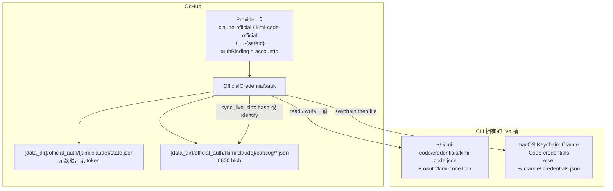
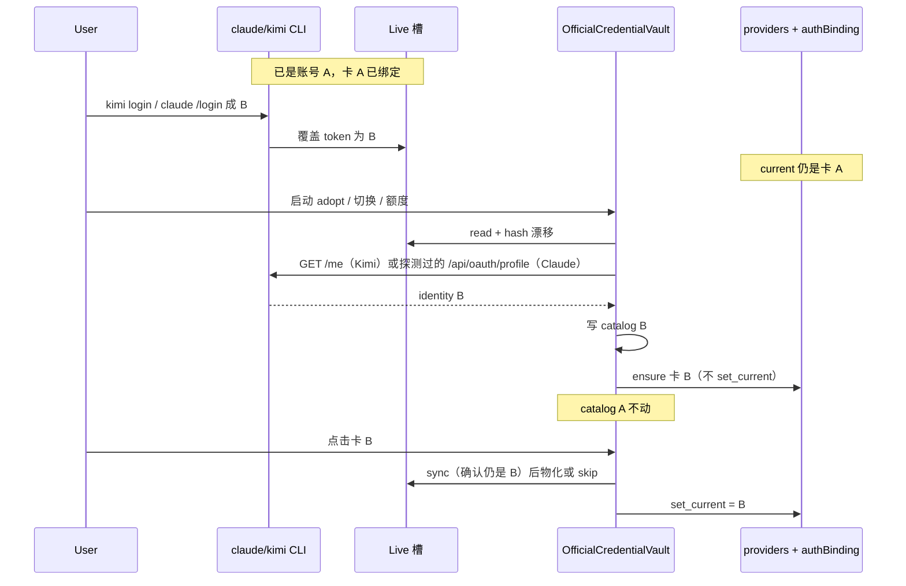
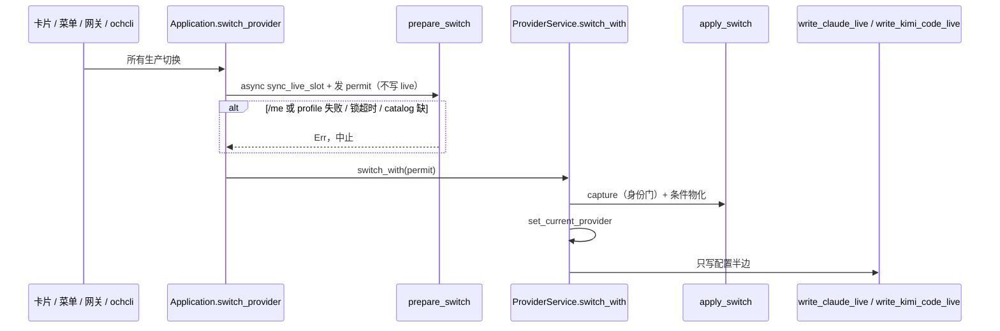

# 官方 CLI 凭据金库：Claude Code 与 Kimi Code 的 capture / restore

| 字段 | 值 |
|---|---|
| 作者 | OcHub design (draft) |
| 日期 | 2026-08-17 |
| 状态 | Draft |
| 读者 | OcHub 资深工程师 |
| 范围 | `ochub-core` / 桌面端 / `ochcli`；**不改** Kimi Code 或 Claude Code 运行时 |
| 取代 | `OcHub/spec/kimi-oauth-account-switch.md`（Kimi-only、OcHub Device Code 登录方案）。**PR1 第一件事**把它标成 Superseded，避免有人按旧稿实现 |

本文 **不是** 旧稿的修订。旧稿里的 Device Code、`KimiOAuthManager`、`ochcli auth kimi login`、GPUI 登录 UI **全部作废**。只保留经源码复核仍成立的运行时事实：Kimi `oauth.key` remap、锁协议、切换入口清单、Claude Keychain-first。

**2026-08-17 产品更正：** 不要按「服务器账号 id」识别人。在哪张官方卡为当前时登录，密钥就绑哪张卡。下文若仍出现 `/me`、`/api/oauth/profile`、`accountId`、自动按身份建 `{seed}-{safeId}`，以本节与 K4–K7 为准，那些是过时草稿。

---

## Overview

Claude Code 与 Kimi Code 的官方 OAuth 都是 **单 live 槽**：CLI 自己登录、自己刷新、自己写回。OcHub 今天只写它们的配置半边（Claude `settings.json` 的空 `env`；Kimi `config.toml` 的 `providers` / `models` / defaults），**从不** 写入或切换官方凭据。结果是：用户用 `claude /login` / `kimi login` 换了账号，OcHub 的「官方卡」无法记住旧账号，也无法在切走 3P 后再把「刚才那个」账号写回去。

本方案让 OcHub 做 **CLI 已拥有的官方 OAuth blob 的 capture + restore**，不做登录。

**绑定单位是卡，不是「账号 id」。** 当前官方卡是 A 时，你在 CLI 登录得到的那份密钥就属于 A。切走 A 时把槽里的字节存进 A 的 catalog；再切回 A 时把 A 的 catalog 写回槽。不需要 `user_id` / `account.uuid` / token 哈希来认出「这是 1 号」。

第二份官方登录：再建（或再切到）另一张官方卡 B，在 B 为当前卡时去 CLI 登录，那份密钥就属于 B。

---

## Background & Motivation

### 今天 OcHub 对官方卡做什么

| | Claude Official | Kimi Official |
|---|---|---|
| 种子 | `claude-official`，`{"env":{}}`（[`providers_seed.rs`](../../../../Users/sleepstars/Documents/code/model-switch/OcHub/crates/core/src/db/dao/providers_seed.rs)） | `kimi-code-official`，`oauth.key = "oauth/kimi-code"` |
| Live 配置写盘 | [`write_claude_live_snapshot`](../../../../Users/sleepstars/Documents/code/model-switch/OcHub/crates/core/src/services/provider/live.rs) **只写** `settings.json` | [`write_kimi_code_live`](../../../../Users/sleepstars/Documents/code/model-switch/OcHub/crates/core/src/apps/kimi_code.rs) **只 merge** `providers` / `models` / `default_*` |
| 官方凭据 | 不读不写（额度除外） | 不读不写（额度除外） |
| 切走回收 | 无。Codex-only 的 [`capture_outgoing_account_state`](../../../../Users/sleepstars/Documents/code/model-switch/OcHub/crates/core/src/services/provider.rs) 对 Claude/Kimi 是 no-op，且失败只 `warn` | 同左 |
| 额度 | [`read_claude_credentials`](../../../../Users/sleepstars/Documents/code/model-switch/OcHub/crates/core/src/services/subscription.rs)：macOS Keychain `Claude Code-credentials` 优先，否则 `~/.claude/.credentials.json` | [`read_kimi_credentials`](../../../../Users/sleepstars/Documents/code/model-switch/OcHub/crates/core/src/services/subscription.rs) **写死** `credentials/kimi-code.json`，**不刷新** |
| 编辑器 | `uses_official_login` 只渲染「使用 {app} 官方登录」文案，无登录控件（[`provider_editor.rs`](../../../../Users/sleepstars/Documents/code/model-switch/OcHub/crates/app/src/provider_editor.rs)） | 同左 |

`managed_auth` 今天只有 `github_copilot` / `codex_oauth`（[`services/auth.rs`](../../../../Users/sleepstars/Documents/code/model-switch/OcHub/crates/core/src/services/auth.rs) `ensure_auth_provider`）。本方案 **不** 往这里加 Device Code。

`AppState::bootstrap`（[`app_state.rs`](../../../../Users/sleepstars/Documents/code/model-switch/OcHub/crates/core/src/app_state.rs)）顺序是：

1. `auto_import_live_providers`（可能把 live 导成 `id=default` / `category=custom`）
2. `init_default_official_providers`
3. `init_official_quota_providers`

首次启动时 `import_default_config` 跑完时 `kimi-code-official` / `claude-official` 行还不存在。官方 OAuth live 会被误导成一张 `default` 自定义卡，之后再种子一张官方空卡，两张卡抢同一个 live 槽。

### Kimi Code：生产槽是函数，不是指针

源码：`kimi-code/packages/oauth`。

`resolveKimiCodeRuntimeAuth`（`managed-kimi-code.ts`）在无 `KIMI_CODE_BASE_URL` / `KIMI_CODE_OAUTH_HOST` 时，若 `configured.key !== expected.key`，**丢掉配置的 key，返回 `oauth/kimi-code`**。chat、`/me`、usage、model refresh 都走这条函数。`refreshOAuthProviderModels` 还会把 remap 后的 key **写回** `config.toml`。search/fetch 本身不直接调它：`WebFetchService` 把该 service 的 `oauth` 交给 `resolveTokenProvider(managed:kimi-code, …)`，后者再跑 `resolveKimiCodeRuntimeAuth`（`authService.ts`）。自定义 services key 同样被 remap 丢掉。

因此：

- 官方 toml 的 `oauth.key` **必须永远** 是 `oauth/kimi-code`
- 切换账号 = 在锁协议下把选定 blob **拷进** `credentials/kimi-code.json`
- 改 toml key **不能** 换账号，只会让 OcHub 与 `kimi` 分裂

Live 锁（`oauth-manager.ts` `resolveLockTarget` / `acquireRefreshLock`）：

1. `mkdir` 父目录 `{configDir}/oauth/`（recursive）
2. touch 空 **sentinel 文件** `{configDir}/oauth/{storageName}`（`writeFile(..., { flag: 'a' })`）。live 槽的 `storageName` 是 `kimi-code`（`resolveKimiTokenStorageName` 去掉 `oauth/`）
3. `proper-lockfile.lock(sentinel)` → 目录 `{sentinel}.lock`，即 `{configDir}/oauth/kimi-code.lock`
4. `stale: 5000`；`retries: { retries: 120, factor: 1, minTimeout: 500, maxTimeout: 1000 }`（约 60–120s）
5. `realpath: false`；拿不到锁 **fail closed**
6. Windows / `KIMI_DISABLE_OAUTH_LOCK=1` 关锁
7. **禁止** 把 sentinel 路径 `mkdir` 成目录

Token 落盘：`credentials/<name>.json`，snake_case（`access_token` / `refresh_token` / `expires_at` 秒 / `scope` / `token_type` / `expires_in`），文件 `0600`，目录 `0700`，tmp+fsync+rename。tombstone 是空 `access_token`。

身份：`GET {baseUrl}/me` 的 `user_id`。`identity.ts` **只** 产 `X-Msh-*` 设备头，不解析 JWT。展示：`email || username || nickname || user_id`。

`write_kimi_code_live` 今天 **不写** `[services.*]`。JS 对象是 `moonshotSearch` / `moonshotFetch`，落盘必须是 **`moonshot_search` / `moonshot_fetch`**（`agent-core` `servicesToToml`）。`kimi logout` 会删掉 `providers['managed:kimi-code']`、其 models、以及两个 moonshot service。

Kimi CLI home：`defaultKimiHome` 在 `KIMI_CODE_HOME` **length > 0** 时用该值（**不 trim**），否则 `~/.kimi-code`。OcHub 今天：`settings.kimi_code_config_dir` 否则 `~/.kimi-code`，**不读** `KIMI_CODE_HOME`。

`parseManagedUserInfoPayload` **只**认 wire 字段 `user_id`（不是 `userId`）。缺 `user_id` 字符串即畸形。展示仍可用 `email` / `username` / `nickname`。CLI `fetchManagedUserInfo` 默认超时 **8s**；OcHub 额度 HTTP 已是 15s。identify 用 15s，与现有 `query_kimi_quota` 对齐，避免卡额度成功、identify 先超时。

`FileTokenStorage.list()` 会枚举 `credentials/*.json` 的全部文件名。把 OcHub catalog 放进该目录会被 CLI 当成额外 token 名。

### Claude Code：Keychain-first 的单 live 槽

官方文档与 OcHub / cc-switch 额度读取一致（cc-switch 同样 **只读不写**）：

1. **macOS**：Keychain service `Claude Code-credentials` **优先**。OcHub / cc-switch / cherry-studio 读时都是 `security find-generic-password -s "Claude Code-credentials" -w`，**不传 `-a`**。CLI 写入时的 account 属性 **未经官方文档证实**（可能是 `$USER`、空、或其它字符串）。物化必须先 dump 现有 item 的 account 再复用，见 K15。
2. 否则 `{get_claude_config_dir()}/.credentials.json`（0600）

JSON（读侧两种 key 都认）：

```json
{
  "claudeAiOauth": {
    "accessToken": "sk-ant-oat01-...",
    "refreshToken": "sk-ant-ort01-...",
    "expiresAt": 1754418735285,
    "scopes": ["user:inference", "user:profile", "..."],
    "subscriptionType": "pro"
  }
}
```

`expiresAt` 是 **毫秒**。token 是 `sk-ant-oat01-` / `sk-ant-ort01-` 不透明串，**不是 JWT**。CLI 会 refresh 并写回 live 槽；capture 必须拿到轮转后的 refresh，否则切回去会 `invalid_grant`。

macOS 上 **只写文件不够**：CLI 先读 Keychain，旧账号会盖过新文件。物化必须写 Keychain，并保持文件同步。Keychain 写失败则整次物化失败，禁止留下「文件已换、Keychain 仍是旧号」的分裂。

用户级 Claude JSON（OcHub 已有的 `get_claude_mcp_path()`，默认 `~/.claude.json`，跟随 Claude override dir）里的 `oauthAccount`（`accountUuid` / `emailAddress` / `organizationUuid`）是 **展示元数据**，不是 token 槽。物化时应 **三个键一起** patch，避免 A→B 后邮箱换了、org 还停在 A；不得整文件覆盖。

**Claude 身份端点是未公开假设，不是已核实事实。** OcHub 与 cc-switch 只用 `GET https://api.anthropic.com/api/oauth/usage` + `anthropic-beta: oauth-2025-04-20`。公开 Anthropic 文档没有 `/api/oauth/profile`。同组织 `nebula-api` 的 `fetch_oauth_profile` 打的是 `GET https://api.anthropic.com/api/oauth/profile`，头是 `Authorization` / `Content-Type` / `User-Agent` / `Accept` / `anthropic-version: 2023-06-01`，**没有** `anthropic-beta`；解析只要 `account.uuid` / `account.email_address` / `organization.uuid`，**没有**顶层 `uuid`。本方案把它当作与 `/api/oauth/usage` 同类的未文档化端点：PR1 必须用一次真实 `claude /login` token 探测成功后才合入 identify。解析 **只** 取 `account.uuid`。`subscriptionType` / access-token hash **禁止**当账号 id。profile 不可用时的回退见 Open Questions：拒绝创建第二张 Claude 卡，不发明 token-hash id。

Anthropic 官方多账号同样是单 live 槽，与 Kimi 同类。用户只用 `claude /login`——这是产品，不是缺口。Claude Desktop 官方卡 **不在** 本范围。

### 切换机械装置（硬约束）

[`ProviderService::switch_with`](../../../../Users/sleepstars/Documents/code/model-switch/OcHub/crates/core/src/services/provider.rs) 是 **同步** 的：

1. Codex `capture_outgoing_account_state`（失败只 warning）
2. `set_current_provider`
3. `write_live_resolving_drift` → `write_live_snapshot`

`current_id == id` 时 **跳过** Codex capture。Kimi/Claude 的凭据 **不能** 挂进这条 warn-and-continue 路径。

会绕过 `Application::switch_provider`、直接打 `ProviderService::switch` / `switch_with` 的生产入口：

| 调用方 | 今天 |
|---|---|
| [`shell_menu.rs`](../../../../Users/sleepstars/Documents/code/model-switch/OcHub/crates/app/src/shell_menu.rs) `perform_menu_switch` | `ProviderService::switch`（已在 `background_spawn`） |
| [`app_ui.rs`](../../../../Users/sleepstars/Documents/code/model-switch/OcHub/crates/app/src/app_ui.rs) station-channel ~2234 | `ProviderService::switch` |
| [`deeplink/provider.rs`](../../../../Users/sleepstars/Documents/code/model-switch/OcHub/crates/core/src/deeplink/provider.rs) `enabled=true` | `ProviderService::switch`（同步） |
| [`gateway/apply.rs`](../../../../Users/sleepstars/Documents/code/model-switch/OcHub/crates/core/src/gateway/apply.rs) `apply_to_app` / `apply_station_to_app*` / `apply_route_to_app` | `ProviderService::switch`（目标 `category=gateway`）。GUI `app_ui.rs` ~2550 在 `background_spawn` 里直接调 `apply_station_to_app` |
| [`application/gateway.rs`](../../../../Users/sleepstars/Documents/code/model-switch/OcHub/crates/core/src/application/gateway.rs) `disconnect_gateway_from_app` | `ProviderService::switch_with`（`official.len()==1` 才回切 official；第二张官方卡会让这条路径直接报 `cannot choose a replacement`） |
| [`deeplink/model_provider.rs`](../../../../Users/sleepstars/Documents/code/model-switch/OcHub/crates/core/src/deeplink/model_provider.rs) ~482 | 同步 `apply_station_to_app_with_policy`（与 `enabled=true` 的 provider deeplink 是另一条栈） |

卡片 / `ochcli provider switch` / remote 走 `Application::switch_provider`，但它本身也只是同步转调 `switch_with`，没有凭据 prepare。

同卡再应用（`current_id == id`，含 drift Preserve）会把 **SQLite 里的 snapshot** 写回 live 配置文件。对官方卡这意味着：绝不能顺手把 catalog 里的旧 token 盖到 CLI 刚刷新过的 live 槽上。

S3 / WebDAV 同步物是 `db.sql` + `skills.zip`（[`sync_protocol.rs`](../../../../Users/sleepstars/Documents/code/model-switch/OcHub/crates/core/src/services/sync_protocol.rs)），**不会** 带走 `~/.ochub` 下的旁路文件。`authBinding` 会随 DB 同步；token 必须留在本机。

---

## Goals & Non-Goals

### Goals

1. 用户只用 CLI 登录：`claude /login`、`kimi login`。OcHub **永不** 发起 OAuth。
2. OcHub 记录 **真实凭据字节**，使官方卡之间、官方 ↔ 3P 之间切换能回到该卡上次收存的密钥。
3. 切走官方卡 A 时：把当前 live 槽字节写入 **A 的** catalog（当前卡拥有槽里那份密钥）。
4. 切入官方卡 A 时：若 A 已有 catalog，物化进 CLI live 槽（Kimi 文件+锁；Claude Keychain+文件）；若 A 还没有 catalog，不覆盖 live，等用户在该卡下 CLI 登录后再收。
5. 第二份官方登录：用户自己再来一张官方卡，切到那张卡后再 `claude /login` / `kimi login`。OcHub **不**根据服务器身份自动建卡。
6. 额度按卡：当前官方卡且 live 就是该卡上次写入/收存的那份（hash 对得上）→ 读 live；否则读该卡 catalog。没有 catalog 的官方卡 → `not_found`，提示在该卡为当前时去 CLI 登录。Codex/Grok 官方额度保持原样。
7. `write_kimi_code_live` 的 toml_edit merge 保持；官方 `oauth.key` 永不改写。
8. Token **不** 进 SQLite `providers.settings_config`。

### Non-Goals

- OcHub / `ochcli` Device Code、浏览器 OAuth、`ochcli auth * login`、GPUI 登录对话框。
- 改 Kimi / Claude 运行时，或让 Kimi 承认 `oauth/kimi-code-acct-*`。
- 一个 CLI 进程热切换账号（切换后需重开 `kimi` / `claude`）。
- `KIMI_CODE_BASE_URL` / `KIMI_CODE_OAUTH_HOST` 环境槽多账号；`oauth.storage = keyring`。
- 把 OAuth access_token 当网关上游 key（官方卡导入网关仍拒绝）。
- Claude Desktop / Grok / Codex 官方凭据（Codex 已有自己的 `auth.json` + `capture_outgoing`）。
- OcHub 代为 refresh OAuth（轮转权在 CLI）。
- 同步 MCP / Skills；改 S3/WebDAV 协议去传 token。

---

## Key Decisions

| # | 决定 | 理由 |
|---|---|---|
| K1 | **OcHub 不登录。** 唯一登录入口是 `claude /login` / `kimi login`。金库只做 read live / write live / catalog / identity-gated capture | 产品拍板。旧稿的 Device Code / `ochcli auth login` / GPUI 登录全部删除 |
| K2 | **一个 `OfficialCredentialVault` + `OfficialLiveBackend` trait，两个后端**（`KimiLive` / `ClaudeLive`）。公共路径：`sync_live_slot` / `materialize` / `adopt` / `token_for_account` | Claude 与 Kimi 同构（单槽 + 轮转 + 卡绑定），差异只在 IO。禁止再复制一套 Manager |
| K3 | **Catalog 放 `official_auth_dir() = get_app_config_dir().join("official_auth")`，文件 0600，目录 0700。不进 SQLite，不进工具 credentials 目录。** 默认家目录下才是 `~/.ochub/official_auth/` | `get_app_config_dir()` 尊重 `--data-dir` / `OCHUB_DATA_DIR` / store override / `OCHUB_TEST_HOME`。写死 `~/.ochub` 会在测试里把 token 漏进真 home |
| K4 | **Catalog 按 Provider 卡 id 存，不按「账号 id」存。** 切走官方卡 A → live 整份写入 `official_auth/{tool}/{provider_id}.json`。切入 A 且该文件存在 → 写回 live。不调用 `/me`、`/api/oauth/profile`，不用 token 当 id | 用户模型：在 A 卡下登录 1 号，密钥就是 A 的。再查 1 号的 user_id 没有产品作用 |
| K5 | **不引入服务器侧账号身份。** 展示名用卡名。Claude 物化时只写回当初收存的整份 blob（含当时的 `oauthAccount` 若已在 blob/旁路文件里），不现场 identify | 上一版用 profile uuid 区分两张卡，是把「卡」和「人」拆开了；产品不需要这层 |
| K6 | **保留种子 `claude-official` / `kimi-code-official`。** 首次启动若 live 已有官方登录、种子还没绑 catalog，把当前 live 收进种子卡。用户要第二套密钥：自己再加一张 `category=official` 的卡，切过去再 CLI 登录 | 第二张卡是用户建的，不是 OcHub 认出新 user_id 后自动长出来的 |
| K7 | **CLI 登录不改 OcHub 当前卡。** 当前是 A 时再登录，只是 A 的 live 被 CLI 覆盖；下次切走 A 时把新字节收进 A（A 换绑到这份新登录）。要保留旧登录，必须先切到（或新建）另一张官方卡再去 CLI 换号 | 这就是「在哪张卡登录，密钥就绑哪张卡」 |
| K8 | **切走官方卡时把 live 收进出站卡；切入有 catalog 的官方卡时物化。** 菜单 / 网关 / deeplink 必须走同一条 Application 切换，不能只改 toml/settings。无 catalog 的官方目标：只切配置、不覆盖 live | 否则会出现「界面已经是 B、槽里还是 A」 |
| K9 | **同卡再应用只 `sync_live_slot`，禁止 catalog → live。** `current_id == target` 时即便目标官方、catalog 更新，也不覆盖 CLI 刚刷新的槽 | `write_live_resolving_drift` 会重写配置半边；凭据半边必须单独豁免 |
| K10 | **切 3P / gateway 先 capture，永不删 OcHub 不拥有的 live 文件或 Keychain 项。** 不新增 `preserve_*_official_auth_on_switch` | 3P 写的是 `settings.json` env / Kimi 3P provider 表。官方 token 仍在槽里，属于上一张官方卡 |
| K11 | **卡额度读该卡 catalog；若该卡是 current 且 live hash 仍对得上上次收存，则读 live（CLI 可能刚刷新）。** 无 catalog → not_found。Codex/Grok 官方分支不动 | 不按「账号 id」选文件，按卡选文件 |
| K12 | **不需要 `authBinding` 指向某个 user_id。** Catalog 文件名就是 `provider.id`。卡删了，对应 catalog 一起删 | 绑定已经表达在「哪张卡的文件」里 |
| K13 | **Kimi home：`KIMI_CODE_HOME`（`length > 0`，**不 trim**，对齐 CLI `defaultKimiHome`）> `settings.kimi_code_config_dir` > `~/.kimi-code`。** 改 `get_kimi_code_config_dir()` | 与 CLI 同一棵树。trim 会让 `" /tmp/x"` 这类值与 CLI 分叉 |
| K14 | **OcHub 不调用 refresh_token。** 过期额度提示「在 CLI 登录或切到该卡让 CLI 刷新后再 sync」 | 双写 refresh 会在 CLI 轮转后分叉。权威刷新者是 CLI |
| K15 | **Claude macOS：先读出现有 Keychain item 的 account 属性再写回同一 item；没有 item 才 `-a $USER`。先 Keychain 成功再写 `{get_claude_config_dir()}/.credentials.json`。`oauthAccount` 三键来自 identify 时写入 `accounts[]` 的 `id` / `email` / `organization_uuid`；缺的键删除而不是留 A 的值。Keychain 失败 abort** | 读路径不带 `-a`。token blob 里没有 org；物化是同步的，必须在 identify 时落盘 |
| K16 | **Bootstrap：官方形态的 live 不导成 `default`；种子 ensure 之后再 adopt。** 粘滞删种则只建 `{seed}-{safeId}` | `import_default_config` 时种子行还不存在 |
| K17 | **v1 拒绝 Kimi 环境槽与 keyring。** 检测到 `KIMI_CODE_BASE_URL` / `KIMI_CODE_OAUTH_HOST` / `oauth.storage=keyring` → adopt/switch 明确报错，不写生产槽 | remap 会把 env 槽与生产槽搅在一起 |
| K18 | **官方 snapshot 形状不变。** Kimi `oauth.key` 恒为 `oauth/kimi-code`；Claude `{"env":{}}`。`KimiCodeConfig.encode` 继续从 `prior_provider` 保活 `oauth` | 改 key / 把 token 塞进 snapshot 都会破坏运行时或泄漏到 SQLite |

### 目录选型（K3 展开）

| 方案 | 优点 | 缺点 |
|---|---|---|
| A. `{get_app_config_dir()}/official_auth/`（默认 `~/.ochub/official_auth/`） | 两工具一份金库；跟 `KIMI_CODE_HOME` / Claude override 解耦；Kimi `FileTokenStorage.list()` 看不到；S3 不同步旁路文件 | 用户换机器只有 binding、没有 token（可接受） |
| B. 工具 credentials 目录 | 和 CLI 文件「放一起」 | Kimi `list()` 会把 `kimi-code-acct-*.json` 当成 token 名；Claude live 是 Keychain，没有多文件目录；home 一改 catalog 孤儿 |

选 **A**。路径函数：

```rust
pub fn official_auth_dir() -> PathBuf {
    crate::paths::get_app_config_dir().join("official_auth")
}
```

默认家目录下的形状（仅作图；测试与 `--data-dir` 都走 `get_app_config_dir()`）：

```
{data_dir}/official_auth/          # 默认 ~/.ochub/official_auth
  kimi/
    state.json                 # 0600，无 token：live_slot_account_id, live_slot_sha256, accounts[]
    catalog/{safe_user_id}.json
  claude/
    state.json
    catalog/{safe_account_uuid}.json
```

`safe_*`：保留 `[A-Za-z0-9_-]`，其余变 `_`，截断 64。Kimi `user_id` 已是 `u_...` 形态。

`state.json` 的 `accounts[]` 存 `id / login / email / organization_uuid / bound_provider_id / updated_at`。**不含 token**。`organization_uuid` 仅 Claude 有值，在 identify 时与 email 一起写入，供同步物化 patch `oauthAccount` 三键。catalog 仍是 CLI 原始 token blob（没有 org 字段）。

写 catalog 用专用 `write_secret_json`（`0600` + tmp+fsync+rename）。**不要** 走现有 `paths::write_json_file`：它会 `sort_json_keys`，打乱 CLI 字段序，并让 hash 与 live 对不齐；`atomic_write` 也不会给新文件 `0600`。

---

## Proposed Design

### 架构



### 模块落点

新目录 `crates/core/src/official_auth/`（**不要** 放进 `managed_auth/`，避免和 Device Code 搅在一起）：

| 文件 | 职责 |
|---|---|
| `mod.rs` | `OfficialTool { Claude, Kimi }`、`OfficialCredentialVault`、对外 API |
| `backend.rs` | `OfficialLiveBackend` trait |
| `kimi.rs` | 文件读写、锁、`/me`、home 解析 |
| `claude.rs` | Keychain+文件、profile、`oauthAccount` patch |
| `store.rs` | `state.json` + catalog IO、hash、safe id |
| `lock.rs` | 与 `proper-lockfile` 兼容的目录锁 |
| `switch.rs` | `prepare_official_switch`、`apply_official_switch`、permit |
| `adopt.rs` | bootstrap adopt、ensure card、跳过 `default` 导入 |

`AppState` 持有 `official_auth: OfficialCredentialVault`（按工具一把进程内 `Mutex` 护 `state.json`；跨进程协调靠 live 锁 / Keychain 原子更新）。**不加** `KimiOAuthManager`。

### 关键接口

```rust
pub enum OfficialTool { Claude, Kimi }

pub struct OfficialAccountId(pub String);

pub struct OfficialIdentity {
    pub id: OfficialAccountId,
    pub login: String,          // 展示：email / username / nickname
    pub email: Option<String>,
    /// Claude：`organization.uuid`，identify 时写入 `accounts[]`。Kimi 恒为 None。
    pub organization_uuid: Option<String>,
}

pub struct LiveSlot {
    pub raw: Vec<u8>,           // 恰好是 CLI 认识的 JSON 字节
    pub sha256: String,         // hex，对 raw 做 SHA-256，不 canonicalize
    pub parsed: serde_json::Value,
}

pub struct SyncOutcome {
    pub owner: Option<OfficialIdentity>,
    pub sha256: String,
}

/// 锁不是 trait 方法：`impl FnOnce` 在 trait 上不是 object-safe。
/// Kimi 用 `KimiLive::with_live_lock` 固有方法；Claude 无跨进程锁。
#[async_trait]
trait OfficialLiveBackend: Send + Sync {
    fn tool(&self) -> OfficialTool;
    fn read_live(&self) -> Result<Option<LiveSlot>, AppError>;
    fn write_live(&self, blob: &[u8]) -> Result<(), AppError>;
    async fn identify(&self, live: &LiveSlot) -> Result<OfficialIdentity, AppError>;
    fn env_unsupported_reason(&self) -> Option<String>;
}

impl OfficialCredentialVault {
    pub async fn sync_live_slot(&self, tool: OfficialTool) -> Result<SyncOutcome, AppError>;
    pub fn materialize(&self, tool: OfficialTool, account: &OfficialAccountId) -> Result<(), AppError>;
    pub async fn adopt_live(&self, state: &AppState, tool: OfficialTool) -> Result<Option<OfficialIdentity>, AppError>;
    /// 卡额度。hash miss 时会 await identify。
    pub async fn token_for_account(&self, tool: OfficialTool, account: &OfficialAccountId) -> Result<AccountToken, AppError>;
    pub async fn prepare_switch(&self, state: &AppState, app: AppType, target_id: &str) -> Result<OfficialSwitchPermit, AppError>;
    /// 只动凭据半边（catalog + 条件物化 live）。不 `set_current`、不写 settings/toml。
    pub fn apply_switch(&self, state: &AppState, app: AppType, outgoing: Option<&Provider>, incoming: &Provider, permit: Option<OfficialSwitchPermit>) -> Result<(), AppError>;
}

/// 仅当 `vault_enabled(app)` 为真时 `switch_with` 才强制 permit。
/// PR3 之前只有 Kimi；PR4 才打开 Claude。未打开的工具整条金库路径是 noop。
fn vault_enabled(app: AppType) -> bool { /* 编译期/设置位，见 PR Plan */ }
```

写 catalog **只有两条路**，都要求「这份 raw 已被 identify 过」：

1. async `sync_live_slot`：hash 命中（state 已有该 blob 的 owner）或 identify 成功之后
2. sync `apply_switch`：**仅当** `live.sha256 == permit.live_sha256`（prepare 刚 identify 过的同一 blob）

禁止第三条：hash 变了却凭 `permit.owner` / 过期 `state.live_slot_account_id` 写 catalog。`apply_switch` **不得** `identify`，也不得 `block_on`。

`sync_live_slot` 算法：

```
1. env_unsupported_reason? → Err
2. with_live_lock:
     slot = read_live()
     若 None → 清 live_slot_*，return owner=None
     若 sha256 == state.live_slot_sha256 且 live_slot_account_id 有值:
          写 catalog[owner] = slot.raw     // write-through 轮转
          return owner
3. // 漂移或无指针：必须 identify，禁止猜
   identity = identify(slot).await    // 失败 → Err，不写任何 catalog
   with_live_lock:                    // 再拿锁，防 identify 期间 CLI 又写了
     slot2 = read_live()
     若 slot2.sha256 != slot.sha256 → 重来（有限次）或 Err
     写 catalog[identity.id] = slot2.raw   // 只写这一个
     state.live_slot_account_id = identity.id
     state.live_slot_sha256 = slot2.sha256
     upsert accounts[] 元数据
4. ensure_official_card(identity)     // 绑种子或建 …-{safeId}；不 set_current
5. return identity
```

**禁止**「出站卡是 A，所以 live 一定是 A」。用户在卡 A 上跑了 `kimi login` 成 B 时，出站仍是 A，live 已是 B。

### 第二账号如何出生

```
1. CLI 当前是 A；OcHub 有卡 A 绑定 + catalog A
2. 用户跑 `kimi login` / `claude /login` 成 B（覆盖 live）
3. OcHub current 仍是 A（不自动切）
4. 下一次 sync_live_slot（启动 adopt / 下一次 switch / 会写 live 的额度）:
   - identify → B
   - 写 catalog B；ensure 卡 B
   - 不覆盖 catalog A
   - 不改 current
5. 用户点卡 B → materialize B 进 live（若 live 已是 B，只 sync）
```

若用户停在卡 A、live 已是 B，再切走 A：**不得** 把 B 收进 catalog A。这只能由 **async** `prepare` / `sync_live_slot` 先 identify。sync `apply_switch` 若发现 `live.sha256 != permit.live_sha256`，**不写任何 catalog**（见下）。



### Provider 卡

种子保持原样。`ensure_official_card(identity)`：

| 条件 | 动作 |
|---|---|
| 已有卡 `authBinding.accountId == identity.id` | 更新展示名以外的元数据；不改 id / current |
| `kimi-code-official` / `claude-official` 存在且未绑定 | bind；名称保持种子英文名 |
| 种子不存在（粘滞删除）或种子已绑别人 | 插入 `{seed}-{safeId}`，`category=official`，克隆种子 `settings_config`，名 `… ({login})` |
| snapshot | Kimi：`oauth.key` 仍是 `oauth/kimi-code`。Claude：仍是 `{"env":{}}` |

`authBinding`：

```json
{
  "source": "official_catalog",
  "authProvider": "kimi_oauth",
  "accountId": "u_xxx"
}
```

Claude 的 `authProvider` 为 `claude_oauth`。`AuthBindingSource` 新增 `OfficialCatalog`（与 Copilot/Codex 的 `ManagedAccount` 分开）。新 helper `ProviderMeta::official_account_id_for("kimi_oauth"|"claude_oauth")`；**不要**复用 `managed_account_id_for`。

`services/auth.rs` 的 `ensure_auth_provider` **不** 增加这两个 id 的 Device Code 分支。`Application::set_auth_binding` / `resolve_account_provider` **不** 认识金库 id：`ochcli auth binding set --auth-provider kimi_oauth|claude_oauth` 返回明确错误「官方 catalog 绑定由 adopt / 切换写入，不能用 auth binding set」。`auth binding list` 只读列出；`auth binding remove` 只摘指针，不删 catalog / live。

### 切换

`Application::switch_provider` 改为 `async`。`prepare` **绝不物化**。

```rust
pub async fn switch_provider(...) -> ApplicationResult<SwitchResult> {
    let mut permit = self
        .state
        .official_auth
        .prepare_switch(&self.state, app_type, id)
        .await?; // vault_enabled=false 或非官方路径 → Ok(noop permit)
    // apply 前再短读一次：hash 已变则重新 prepare（async identify），
    // 避免丢掉 prepare 与点击之间的同账号 refresh。只重试一次。
    if vault_enabled && live_sha256() != permit.live_sha256 {
        permit = self.state.official_auth.prepare_switch(&self.state, app_type, id).await?;
    }
    // … drift policy 与今天相同 …
    Ok(ProviderService::switch_with(&self.state, app_type, id, resolution, Some(permit))?)
}
```

`OfficialSwitchPermit` 字段：`app`、`target_id`、`owner: Option<OfficialAccountId>`、`live_sha256`、`materialize: bool`。

**permit 对「切入官方卡」有效**（是否允许 materialize）：

```
permit.app == app
&& permit.target_id == incoming.id
&& permit.materialize
```

**permit 对「写 catalog」有效**（是否允许 capture / write-through）——比上一行更严：

```
上一行成立（或官方→3P 的 capture permit）
&& 短读 live.sha256 == permit.live_sha256
```

`state.live_slot_account_id` 与 `permit.owner` **不是** hash 变化后的身份神谕：prepare 之后 `state.live_slot_sha256` 按定义是旧 hash，新 blob 未经 identify。token 不是 JWT，sync `apply_switch` 不能本地解析身份，也禁止 `block_on` identify。

`Application::switch_provider`（async）在调用 `apply` **之前** 再短读一次 live hash。若已变，**重新 `prepare` 一次**（async identify + 按新身份写 catalog），再用新 permit 去 `apply`。这样 A 在 prepare 与点击之间被 CLI 刷新时，catalog A 能吃到新 refresh。第二次 prepare 后 hash 仍变（槽在竞态）→ 按下面 `apply_switch` 的 mismatch 规则处理，不再第三次 prepare。

`prepare_switch`：

| 情形 | 行为 |
|---|---|
| `!vault_enabled(app)` 或非 Claude/Kimi | noop permit |
| 目标官方 + 无 binding / catalog 缺或 tombstone | **Err**（「请先在终端运行 `kimi login` / `claude /login`」） |
| 目标官方 + `current != target` | `sync_live_slot`；`materialize = true` |
| 目标官方 + `current == target` | `sync_live_slot`；`materialize = false` |
| 目标 3P/gateway + 出站官方 | `sync_live_slot`；`materialize = false` |
| 目标 3P + 出站非官方 | noop permit |

`switch_with` 对 `vault_enabled` 的 app **不再** 走 Codex `capture_outgoing`。顺序必须写成三步：

```
switch_with(app, incoming, resolution, permit):
  1. vault.apply_switch(outgoing, incoming, permit)?
       // 只动凭据：catalog capture ± live 物化
       // 不 set_current，不写 settings.json / config.toml
  2. set_current_provider(incoming.id)
  3. write_live_resolving_drift(...)   // 只写配置半边
```

`apply_switch` 门闩（**这是 Issue 1 的修正**）：

```
needs_official_materialize =
    vault_enabled(app)
    && incoming.category == official
    && current != incoming.id

若 needs_official_materialize:
    必须有有效 permit 且 permit.materialize
    无 permit / permit 无效 → Err("official credential switch requires prepare")
    **禁止** hash-only 放行          // 稳定槽 A→B 正是这种

否则若 vault_enabled && outgoing 官方 && current != incoming.id:
    // 官方 → 3P/gateway
    有 permit 且 live.sha256 == permit.live_sha256
        → 仅当 outgoing.official_account_id == permit.owner 才写 catalog
    有 permit 但 hash 已变
        → 不写 catalog；Err(official_auth.prepare_required)
          （让 async switch_provider 再 prepare 一次）
    无 permit：
      hash 命中 state → capture-or-skip（owner==outgoing 才写 catalog）
      hash 漂移 → Err(official_auth.prepare_required)

否则: 同卡 / 3P→3P / 金库未启用 → 凭据 no-op
      // 「live 槽存在」本身不加门闩，避免 3P→3P 裸 switch 被误杀
```

capture / materialize 规则（在门闩之后；**这是本轮 P0**）：

```
slot = 短读 live

// 写 catalog：只有「permit 已 identify 的同一份字节」
可 capture =
    permit 存在
    && slot.sha256 == permit.live_sha256
    && outgoing 官方
    && outgoing.official_account_id == permit.owner

若 可 capture:
     write-through outgoing catalog = slot.raw（与 prepare 幂等）
否则:
     **不写任何 catalog**
     // 包括：hash 变了、无 permit、owner 对不上 outgoing
     // 禁止用 permit.owner / 过期 state 当新 blob 的身份

若 permit.materialize:                    // 切入官方卡
     catalog 缺/tombstone → Err
     即便 hash 已变：仍 materialize(incoming)
       // 用户点的是 B；把未经 identify 的中间字节盖掉是产品
       // 那些字节不得写入任何 catalog
     返回时若 hash 已变：warning official_auth.live_hash_changed_skipped_capture
若 incoming 官方且 current == incoming:
     禁止 materialize
若 incoming 为 3P/gateway:
     不删 live 文件 / Keychain
     且 hash 已变 → 上面门闩已返回 prepare_required
```

失败切面（**prepare 从不写 live**；**apply 在 hash 变化时从不写 catalog**）：

| 失败点 | current | live 凭据 | catalog | 配置半边 | 返回 |
|---|---|---|---|---|---|
| prepare 失败 | 旧 | 旧 | 不动 | 旧 | Err，无 permit |
| apply 官方→3P 且 hash 已变 | 旧 | 旧 | 不动 | 旧 | `official_auth.prepare_required` |
| apply 的 capture 其它失败 | 旧 | 旧 | 不动 | 旧 | Err |
| apply 已物化（可能跳过 capture）、`set_current` 失败 | 旧 | **目标账号** | 出站未因 mismatch 被改 | 旧 | `official_auth.live_ahead_of_current`。**不回滚 live** |
| `set_current` 成功、`write_live_resolving_drift` 失败 | 新 | 新 | 仅在 hash 匹配时对齐过出站 | 可能旧 | `official_auth.config_write_failed` |

禁止在同步栈 `block_on` prepare。GUI 用已有 `core_async::run`。



#### 必须改成 async 的外观，以及调用方

机械 PR（行为不变）先把这些改成 `async`，金库 PR 再接入 prepare。**不要**在 outgoing 是官方时拒绝 Apply station——那是首次接网关的主路径。

```rust
// Application
pub async fn switch_provider(...) -> ApplicationResult<SwitchResult>;
pub async fn add_provider_to_live(...) -> ApplicationResult<SwitchResult>;
pub async fn delete_provider(...) -> ApplicationResult<()>;
pub async fn apply_gateway_station(...) -> ApplicationResult<apply::ApplyResult>;
pub async fn disconnect_gateway_from_app(...) -> ApplicationResult<Value>;
pub async fn import_deeplink(...) -> ApplicationResult<Value>;
pub async fn adopt_official_live_slots(&self) -> ApplicationResult<()>;

// gateway/apply.rs
pub async fn apply_to_app(...) -> Result<ApplyResult, AppError>;
pub async fn apply_station_to_app(...) -> Result<ApplyResult, AppError>;
pub async fn apply_station_to_app_with_policy(...) -> Result<ApplyResult, AppError>;
pub async fn apply_route_to_app(...) -> Result<ApplyResult, AppError>;
// 内部拆成：upsert_gateway_provider（同步）+ switch_provider（async）
```

| 调用方 | 改法 |
|---|---|
| `app_ui.rs` `do_switch` → `apply_provider_switch` | 已走 Application；改 await |
| `ochcli` `provider switch` / `delete` / `import_deeplink` / `gateway apply` | 已在 async `execute`，改 await |
| `remote/backend.rs` | 已是 async，改 await |
| `application/declarative.rs` | 已在 async apply 里，改 await |
| `shell_menu.rs` `perform_menu_switch` | `core_async::run(Application::switch_provider)` |
| `app_ui.rs` station-channel ~2234 | 改调 Application（目标 gateway → prepare 只 sync） |
| `app_ui.rs` ~2550 `apply_station_to_app` | `core_async::run(apply_station_to_app)`，**允许** outgoing 官方 |
| `deeplink/provider.rs` `enabled=true` | 随 `import_deeplink` 改 async；仍可导入卡 |
| `deeplink/model_provider.rs` ~482 | 随 `import_deeplink` await `apply_station_to_app_with_policy` |
| `gateway/apply.rs` 整条 apply_* | 改 async，走 Application switch |
| `application/gateway.rs` disconnect | **必须** Application。多官方卡选卡规则见下 |
| `live.rs` 单测 | 官方凭据用例走 Application + prepare；3P→3P 仍可裸 `switch` |

`AppState::bootstrap` / `Application::open` **保持同步**（`main.rs` ~440、ochcli 构造）。adopt 不放进 `bootstrap`。

```
bootstrap() 同步：跳过官方 live 的 default 导入 + 种子
adopt_official_live_slots() async：sync_live_slot + ensure card
```

- GUI：窗口起来后 `core_async::run(adopt_official_live_slots)`。完成前官方卡按未绑定渲染（额度 not_found，「正在识别 CLI 登录…」）。
- ochcli：`execute()` 在 `Application::open` 之后立刻 `await adopt_official_live_slots()`。
- 测试：显式 await adopt，不要依赖 `open()` 副作用。

#### 网关断开后选哪张官方卡

今天 `official.len() != 1` 就报错。第二张官方卡会让「断开回切 official」静默坏掉。

```
candidates = 非 gateway 的 official 卡
若 len == 1 → 那张
若 len > 1:
  若 live_slot_account_id 有绑定卡 → 那张
  否则若种子卡已绑定 → 种子
  否则 → 现有「请显式切换」错误
然后 Application::switch_provider(target)   // 走 prepare，会物化
```

硬门闩（`vault_enabled` 之后）：`incoming` 官方且 `current != incoming` 且无有效 permit → `Err`。**即使 hash 命中。** 测试 `debug_assert`。

### Kimi 后端

**Home**（K13）：改 [`get_kimi_code_config_dir`](../../../../Users/sleepstars/Documents/code/model-switch/OcHub/crates/core/src/apps/kimi_code.rs)：

```rust
pub fn get_kimi_code_config_dir() -> PathBuf {
    if let Ok(home) = std::env::var("KIMI_CODE_HOME") {
        // 对齐 CLI defaultKimiHome：length > 0，不 trim
        if !home.is_empty() {
            return PathBuf::from(home);
        }
    }
    crate::settings::get_settings()
        .kimi_code_config_dir
        .map(PathBuf::from)
        .unwrap_or_else(|| crate::paths::get_home_dir().join(".kimi-code"))
}
```

**读 live**：`{home}/credentials/kimi-code.json`。缺文件 = 未登录。tombstone（空 `access_token`）= 已吊销，不当成有效账号。

**写 live**：与 CLI 相同的 tmp+fsync+rename+`0600`，**原样写入 catalog 字节**（不经 `sort_json_keys`）。持 `oauth/kimi-code` 锁。

**锁**（`lock.rs`）：兼容目标是 **磁盘产物**，不是自造一份 proper-lockfile。PR1 必须先从一次真实 `kimi` refresh 抓一份 `oauth/kimi-code.lock/` fixture（`proper-lockfile@4.1.2`，Kimi 参数 `stale: 5000`、`realpath: false`、未设 `update` → 默认 `stale/2 = 2500ms` 刷新 mtime）。

实现约束：

1. `create_dir_all(home/oauth)`
2. append 创建 **文件** `home/oauth/kimi-code`。该路径已是目录 → **Err**，不要 `remove_dir`
3. 排他 `create_dir(home/oauth/kimi-code.lock)`（lock **是目录**）
4. 目录内允许 proper-lockfile 的 marker（常见为 PID 文件）。OcHub 持锁期间按 ≤ 2500ms 刷新 **目录** mtime
5. **steal 只在 lock 目录 mtime 超过 `2 × stale = 10s` 后**。5s 就 `remove_dir` 会在 CLI 漏一次 utimes 时抢走活锁
6. 回收 stale 用 `remove_dir_all`（目录里有文件时 `remove_dir` 会失败）
7. 重试 120 × 500–1000ms；Windows / `KIMI_DISABLE_OAUTH_LOCK=1` 不锁，仍原子写
8. 拿不到锁 → fail closed

集成测试必须能种一份真实 fixture 并断言：OcHub 不抢未过期锁、过期后能回收、sentinel 始终是文件。K17 拒绝 `keyring` 只是防御：`OAuthStorageBackend` 今天只有 `'file'`。

**identify**：`GET {baseUrl}/me`，`Authorization: Bearer {access_token}`。只解析 wire `user_id`。超时 **15s**（与 `query_kimi_quota` 相同，不是 CLI 的 8s）。失败 → `sync_live_slot` 对 **capture / 物化** fail closed，不写 catalog。工具级额度另有降级（见下）。

**环境槽**：`KIMI_CODE_BASE_URL` 或 `KIMI_CODE_OAUTH_HOST` / `KIMI_OAUTH_HOST` 非空 → `env_unsupported_reason`。keyring 同理。

**配置半边**：`write_kimi_code_live` 仍只 merge providers/models/defaults。官方切换额外调用 `ensure_kimi_official_services`（**不要** 塞进通用 merge）：

- 用 `toml_edit` 打 `[services.moonshot_search]` / `[services.moonshot_fetch]`
- 字段 snake_case：`oauth.key`、`oauth_host`。不要写 `oauthHost`
- 若同时存在 camelCase 遗留表：两套 `oauth` 都改成 `{ storage = "file", key = "oauth/kimi-code" }`，删 camel
- 表已在：只改 oauth 指针
- 表不在（含 `kimi logout`）：官方切换时重建（`base_url = {api}/search` 与 `{api}/fetch`，`api_key = ""`）
- 3P 切换：不删 services、不删凭据文件
- `[services]` 不进 SQLite

`KimiCodeConfig.encode`：从 `prior_provider` 保留 `oauth`。官方 prior 无 oauth 时注入种子形状。`set_or_remove` 丢掉空 `api_key` 是现有行为，不要为此写入假 key。

### Claude 后端

**读**：与 [`read_claude_credentials`](../../../../Users/sleepstars/Documents/code/model-switch/OcHub/crates/core/src/services/subscription.rs) 相同优先级，但返回 **整段 JSON 字节**（不是只抽 accessToken）。macOS：`security find-generic-password -s "Claude Code-credentials" -w`。Keychain 有条目则它是权威，hash 按这段 stdout 算（trim 末尾换行）。

**写（物化）** — 全程 `std::process::Command` argv，**不走 shell**：

```
1. 校验 blob 能解析出 claudeAiOauth | claude.ai_oauth，且 refreshToken 非空
2. macOS:
   a. security find-generic-password -s "Claude Code-credentials"
      （不带 -w）解析现有 item 的 acct / "acct"<blob>= 字段
   b. account = 现有 acct，若无 item 才用 $USER / whoami
   c. security add-generic-password -s "Claude Code-credentials"
        -a <account> -w <json 作为单个 argv> -U
      优先 -U 原地更新，保留 ACL；不要先 delete 再 add
   d. 不主动加 -T。若 GUI 被拒绝，错误说明「在钥匙串允许 OcHub」，禁止回退文件-only
   e. 失败 → Err，停止，不写文件
3. 写 {get_claude_config_dir()}/.credentials.json，0600，不排序 key
4. patch get_claude_mcp_path() 的 oauthAccount（跟随 Claude override）：
     读 accounts[] / OfficialIdentity（identify 时落盘的元数据，不是 token blob）
     accountUuid      = identity.id（必写）
     emailAddress     = identity.email，若 None 则 **删除该键**（不要留下 A 的邮箱）
     organizationUuid = identity.organization_uuid，若 None 则 **删除该键**（不要留下 A 的 org）
     不得整文件覆盖
```

Linux / Windows v1：只写文件。不引入 Windows Credential Manager。

**identify**（未文档化，与 `/api/oauth/usage` 同类）：

```
GET https://api.anthropic.com/api/oauth/profile
Authorization: Bearer {accessToken}
Content-Type: application/json
Accept: application/json
User-Agent: 与 nebula-api 相同的 claude-cli UA（或 OcHub 自己的，探测时两种都试）
anthropic-version: 2023-06-01
anthropic-beta: oauth-2025-04-20          # 与额度同一组；nebula profile 调用没带，两种都接受
```

解析并 **立刻写入** `OfficialIdentity` / `accounts[]`（物化是同步的，不能再打 profile）：

| 字段 | 来源 |
|---|---|
| `id` | **只** `account.uuid`（不要顶层 `uuid`） |
| `email` / `login` | `account.email_address` |
| `organization_uuid` | `organization.uuid`（缺则 None） |

401/403 当过期。PR1 合入 identify 前必须对真实 `claude /login` token 探测 200。Kimi identify 只填 `id`（`user_id`）+ `login`/`email`，`organization_uuid = None`。

离线回退：仅 `get_claude_mcp_path()` 的 `oauthAccount.accountUuid` 非空 **且**（该 uuid 已有 catalog，或首次 adopt、`live_slot_sha256` 为空）。hash 已漂且 uuid 对不上任何 catalog → **禁止**当新身份。profile 不可用则 **拒绝创建第二张 Claude 卡**（Open Questions），不发明 token-hash id。

**禁止** 把 `CLAUDE_CODE_OAUTH_TOKEN` 环境变量当 live 槽。若检测到该变量，物化仍写 Keychain/文件，但 warning：CLI 可能忽略槽、继续用 env。

### Bootstrap / adopt

改 [`import_default_config`](../../../../Users/sleepstars/Documents/code/model-switch/OcHub/crates/core/src/services/provider/live.rs)：

- Kimi：snapshot 是 `managed:kimi-code` + `oauth.key == oauth/kimi-code` + 空/缺 `api_key` → `Ok(false)`，不当 `default`
- Claude：`env` 无 `ANTHROPIC_API_KEY` 且无 `ANTHROPIC_BASE_URL`（含完全空 `env`）→ `Ok(false)`

`bootstrap()` **保持同步**，只做「官方形态 live 不导 default」+ 种子。**不**在这里 `await adopt`。

`Application::adopt_official_live_slots()`（async）在种子之后跑：`adopt_live(Kimi)` + `adopt_live(Claude)`。调度见上一节：GUI 首屏空闲任务、ochcli `execute` 开头。完成前官方卡按未绑定展示。

`adopt_live` = `sync_live_slot` + `ensure_official_card`。不物化。`current` 为空时把 DB 指针填到绑定卡，不写 live。`current` 已有值则不动。

### 额度

[`query_usage`](../../../../Users/sleepstars/Documents/code/model-switch/OcHub/crates/core/src/services/provider/usage.rs) 官方快捷分支今天是 **一个** `if` 盖住 `Claude | Codex | KimiCode | GrokBuild`。必须拆臂，禁止把 binding 检查套到 Codex/Grok 上：

```
if provider.category == official {
    match app_type {
        Claude | KimiCode if vault_enabled(app_type) => {
            account = meta.official_account_id_for("claude_oauth"|"kimi_oauth")
            若 None → not_found「请在终端运行 `claude /login` / `kimi login`」
                       禁止 read_claude_credentials / read_kimi_credentials
            token = vault.token_for_account(account).await
            query_claude_quota / query_kimi_quota
        }
        Codex | GrokBuild | _ => {
            // 行为与今天完全相同
            get_subscription_quota(app_type.as_str())
        }
    }
}
```

`token_for_account(account)`（async）：

```
短读 live hash
若 hash 命中且 state.owner == account:
    用 live access token（可 write-through catalog）
否则:                                  // 分不清「A 刚刷新」和「live 已是 B」
    outcome = sync_live_slot().await
    若成功 && owner == account → live + write-through 该 catalog
    若成功 && owner != account → 只用该卡 catalog；禁止写别人、禁止动 live
    若 identify 失败 → 退回该卡 catalog（可能 stale），**不写 catalog、不建卡**
catalog 缺/tombstone → NotFound / Expired，提示 CLI 或切到该卡
```

`get_subscription_quota("claude"|"kimi-code")`（托盘 / 无卡上下文）：

```
试 sync_live_slot
若成功且有 owner → 用该 live token
若 identify 失败但 live 里有 access token → 仍打 /usage 或 /usages
    **不写 catalog、不 ensure card**
若无 live → not_found
```

OcHub **不**发 refresh_token grant。过期文案指向 CLI。

### UI / CLI

`uses_official_login` / `render_official_auth_section` 是 Claude、**Claude Desktop**、Codex、Kimi、Grok **共用**的。本方案只改：

```
match app_type {
    AppType::Claude => 「请在终端运行 `claude /login`。…」
    AppType::KimiCode => 「请在终端运行 `kimi login`。…」
    _ => 保持今天的「使用 {app} 官方登录」   // Codex Device Code / Grok / Desktop 不动
}
```

Claude / Kimi 已绑定：显示 `login` / 绑定时间。「凭据由 CLI 管理。切换到此连接会把它写回 CLI。」无登录按钮。重启 CLI 的提示只在 **显式切换成功** 后出现。

不新增 `ochcli auth kimi/claude *`：

- `ochcli provider switch`（prepare）
- `ochcli quota`
- `ochcli auth binding list`（只读，含 `official_catalog`）
- `ochcli auth binding set`：**拒绝** `kimi_oauth` / `claude_oauth`
- `ochcli auth binding remove`：只摘指针

### 删除卡 / 忘记账号

`Application::delete_provider` 改为 async。`ProviderService::delete` 保持同步（只删 DB 行）。

```
删官方卡 P（绑定 A）:
  先 await sync_live_slot
    identify 失败 → 删卡失败，避免误伤 live
  清 P.authBinding；ProviderService::delete(P)
  若无其它卡绑 A：删 catalog A 与 state.accounts[A]
  仅当确认 owner == A 时才动 live
  owner == C：live 与 catalog C 不动
```

没有 OcHub「登出并吊销 refresh」API。用户去 CLI `logout`。

---

## API / Interface Changes

### Application

```rust
// Application：下列全部从 sync 改为 async（机械 PR 先改签名，行为不变）
pub async fn switch_provider(...) -> ApplicationResult<SwitchResult>;
pub async fn add_provider_to_live(...) -> ApplicationResult<SwitchResult>;
pub async fn delete_provider(...) -> ApplicationResult<()>;
pub async fn apply_gateway_station(...) -> ApplicationResult<apply::ApplyResult>;
pub async fn disconnect_gateway_from_app(...) -> ApplicationResult<Value>;
pub async fn import_deeplink(...) -> ApplicationResult<Value>;
pub async fn adopt_official_live_slots(&self) -> ApplicationResult<()>;

// 保持同步
pub fn bootstrap(&self);          // AppState
pub fn open(options) -> ApplicationResult<Application>;
```

`ProviderService::switch_with` 增加 `permit: Option<OfficialSwitchPermit>`。三参数 `switch` 在 `vault_enabled && incoming 官方 && current != incoming` 时 **无 permit 即失败**（hash 命中也不行）。

新错误：

- `official_auth.need_cli_login`
- `official_auth.prepare_required`
- `official_auth.identity_failed`
- `official_auth.lock_timeout`
- `official_auth.claude_keychain_write_failed`
- `official_auth.env_slot_unsupported`
- `official_auth.live_ahead_of_current`
- `official_auth.config_write_failed`
- `official_auth.live_hash_changed_skipped_capture`（warning：物化了 incoming，未 capture 新 live）

`AuthBindingSource::OfficialCatalog` 新变体。

### `managed_auth` / `ochcli auth`

**无新登录命令。** `ensure_auth_provider` 不增加 `kimi_oauth` / `claude_oauth`。`resolve_account_provider` 继续只查 Copilot/Codex。`set_auth_binding` 遇到这两个 provider → 明确错误。

### GPUI

只改 **Claude / Kimi** 官方卡说明与额度错误串。Codex / Grok / Claude Desktop 文案不动。无 Device Code 对话框。adopt 完成前显示「正在识别 CLI 登录…」。

---

## Data Model Changes

无 SQLite schema migration。

`providers.meta.authBinding`：`source=official_catalog`。`settings_config` **禁止** 出现 token。无 SQLite 表变更；这是 meta JSON 新变体。

`official_auth/*/state.json` 示例：

```json
{
  "version": 1,
  "live_slot_account_id": "u_B",
  "live_slot_sha256": "…",
  "accounts": [
    {
      "id": "u_A",
      "login": "a@x.com",
      "email": "a@x.com",
      "organization_uuid": null,
      "bound_provider_id": "kimi-code-official",
      "updated_at": 0
    },
    {
      "id": "acc-uuid-b",
      "login": "b@x.com",
      "email": "b@x.com",
      "organization_uuid": "org-uuid-b",
      "bound_provider_id": "claude-official-acc-uuid-b",
      "updated_at": 0
    }
  ]
}
```

S3/WebDAV：binding 随 DB 到目标机；catalog 不去（`official_auth/` 在 `get_app_config_dir()` 下，不在 `db.sql`）。目标机切官方卡 → catalog 缺 → 明确「在此机器上用 CLI 登录一次」。不要把 `official_auth/` 加进 `IMPORT_SIDE_FILES`。数据目录搬迁（`OCHUB_DATA_DIR` / `--data-dir`）由 `official_auth_dir()` 自动跟上。

---

## Alternatives Considered

### 1. OcHub 内 Device Code 登录（旧稿）

多账号不必回 CLI，和 Codex/Copilot 对称。否决：产品明确不要 OcHub 登录；Kimi/Claude 的 refresh 与设备头本就由 CLI 拥有；再实现一套 OAuth 会与 CLI 抢槽。

### 2. 改 toml `oauth.key` 为 per-account / 让 Kimi 认 `oauth/kimi-code-acct-*`

长期最干净，但是 **Kimi PR**，且 `resolveKimiCodeRuntimeAuth` 今天会静默拨回。本交付不改运行时。

### 3. 把 token 放进 SQLite `settings_config`（Codex `auth` 那样）

Codex 的 live 就是 `auth.json`，和 snapshot 同形。Kimi/Claude 的权威在 CLI 槽且会轮转；进 SQLite 等于第二份 SoT，还会进 `db.sql` 云同步。否决。

### 4. Catalog 放工具 credentials 目录

见 K3。Kimi `list()` 与 Claude Keychain 都不适合。

### 5. 只改 `Application::switch_provider`，不改 `switch_with`

菜单 / station / deeplink / gateway apply / gateway disconnect 会继续漏物化。否决。必须 Application 收口 **且** `switch_with` 对「切入另一张官方卡」硬性要求 permit（hash 命中也不例外）。

### 6. OcHub 代 refresh

额度更好看，但和 CLI `ensureFresh` 抢 `refresh_token`。Kimi 锁能缓解、Claude Keychain 没有同等锁。v1 不 refresh；靠 sync 吃 CLI 已轮转的字节。

---

## Security & Privacy Considerations

| 威胁 | 严重度 | 缓解 |
|---|---|---|
| catalog / live 含 refresh_token | P0 | 0600；不进 SQLite；不进 S3/WebDAV；日志只打 account id 与 sha256 前 8 位 |
| 把未经 identify 的 live 写入出站 catalog | P0 | `apply_switch` 只在 `sha256 == permit.live_sha256` 时 write-through；测试 21 |
| macOS 文件-only restore 导致 CLI 仍用旧号 | P0 | Keychain 先写，失败 abort |
| 把 sentinel `mkdir` 成目录，打坏 CLI refresh | P0 | 锁实现禁止 mkdir 该路径；测试 |
| 改 `oauth.key` 导致 OcHub/CLI 分裂 | P0 | 官方写出恒为 `oauth/kimi-code`；测试 |
| 菜单/网关绕过 prepare | P0 | 切入官方卡无有效 permit → Err（**hash 命中也失败**） |
| `security` 拉起钥匙串授权对话框 | P2 | 复用现有 item 的 acct / ACL；失败则提示允许 OcHub，禁止文件-only |
| 同步 DB 后目标机有 binding 无 token | P2 | 切换失败并提示本机 CLI 登录，不静默用别人 live |
| `CLAUDE_CODE_OAUTH_TOKEN` 盖过槽 | P2 | 检测并 warning |
| 进程内 `state.json` 竞态 | P3 | Vault mutex + live 锁 |

`identify` / 额度请求只带 access_token，不带 refresh。Kimi `/me` 不需要也不发送伪造的 `X-Msh-*`（只读 profile；与旧稿 Device Code 不同）。

---

## Observability

日志（info / warn，无 token）：

- `official_auth.sync tool=kimi hash_hit owner=u_A`
- `official_auth.sync tool=claude hash_drift identified=acc_B created_card=claude-official-acc_B current_unchanged=1`
- `official_auth.capture skipped outgoing=kimi-code-official owner=u_B`
- `official_auth.materialize tool=claude account=acc_B keychain=ok file=ok`
- `official_auth.prepare_denied reason=catalog_missing`
- `official_auth.lock_timeout tool=kimi path=~/.kimi-code/oauth/kimi-code.lock`

指标（进程内计数即可，不必新系统）：

- `official_auth_sync_total{tool,result=hit|drift|error}`
- `official_auth_switch_total{tool,result=ok|aborted}`
- `official_auth_keychain_write_fail_total`

延迟目标：hash 命中的 switch 额外开销 < 50ms；identify 超时 15s（与额度 HTTP 一致）；Kimi 锁等待与 CLI 同级（最多 ~120s），超时必须 surfacing，不能当 warning。

---

## Rollout Plan

这是一列车，**不是**五个互不依赖的合并。`vault_enabled(Kimi)` / `vault_enabled(Claude)` 是两个编译期开关（`const` 或内部 feature 位），默认关，对应 PR 打开。

- PR 必须按序合入，**按反序回滚**（PR4 → PR3 → PR2 → PR1）。
- 打开 Kimi 金库的那一 PR **同时**交付 Kimi 按卡额度，避免两张 Kimi 官方卡显示同一份 live 额度。
- Claude 在其开关打开前，`prepare_switch` / `apply_switch` 对 `AppType::Claude` 是 **noop**（与今天一样只写 `settings.json`）。
- 不要在「live 槽存在」时对 3P→3P 开火。
- 回滚不删用户 Keychain / `kimi-code.json`；catalog 文件可留。

未绑定官方卡在开关打开前行为与今天接近。开关打开后，未绑定卡的额度改为 `not_found` + CLI 提示。

---

## Risks

| 风险 | 严重度 | 缓解 |
|---|---|---|
| `/api/oauth/profile` 404 / 改字段 | P1 | PR1 真实 token 探测；只解析 `account.uuid`；失败则拒绝第二张 Claude 卡 |
| 与正在跑的 `kimi ensureFresh` 抢锁 | P2 | 按 fixture 兼容；steal 要 2×stale；超时失败 |
| 同卡再应用仍写 stale catalog | P0 | materialize 门闩 + 测试 |
| 同步栈漏改导致 apply_station 失败 | P0 | 机械 PR 把 apply_* / delete / import 改 async；**禁止**在 outgoing 官方时拒 apply_station |
| 第二张官方卡弄坏网关断开 | P1 | 按 `live_slot_account_id` 选卡 + 测试 |
| Keychain `-a $USER` 建出第二条 | P0 | 复用现有 acct；测试非 $USER 账号 |
| 用户删种子后又登录 | P2 | 只建 `{seed}-{safeId}` |
| Claude Keychain ACL | P2 | 错误指向「允许 OcHub」；禁止文件-only |

---

## Tests

放在 `crates/core/src/official_auth/` 与现有 `provider/live.rs` 集成测试。数据目录走 `OCHUB_TEST_HOME` / `get_app_config_dir()`（**不是**写死 `~/.ochub`）。Keychain 用假 `security` 注入。

必须覆盖（缺一不可）：

1. **`capture_does_not_write_foreign_live_into_outgoing_catalog`**：current=A，live hash 漂到 B，`/me` 返回 B。`apply_switch(A→3P)` 后 catalog A 仍是旧字节，catalog B 为新字节，current 变为 3P。
2. **`switch_away_from_a_while_live_is_b_skips_capture_a`**：同上，即使调用方「以为」出站是 A。
3. **`second_cli_login_creates_card_without_changing_current`**：adopt 后多一张 `{seed}-{safeId}`，`current` 仍是 A。
4. **`same_card_reapply_does_not_materialize_stale_catalog`**：current=A，live 已被 CLI 刷新（hash≠catalog），`switch(A)` 只 sync write-through，catalog 变新，live 不被旧 catalog 覆盖。
5. **`claude_macos_materialize_writes_keychain_then_file`**：注入 `security` stub；断言先 dump acct、再 `-U` 写回同一 acct、再写文件。
6. **`claude_macos_keychain_failure_aborts_without_file_write`**：Keychain 非 0 退出 → `Err`，`.credentials.json` 保持旧账号。
7. **`claude_keychain_updates_existing_non_user_account`**：已有 item 的 acct 不是 `$USER`（例如 `Claude Code`）时被更新，**不**新建第二条。
8. **`kimi_oauth_key_never_rewritten`**：官方 A→B→3P→B 后 `oauth.key` 仍是 `oauth/kimi-code`。
9. **`kimi_lock_matches_proper_lockfile_fixture`**：种一份真实 `oauth/kimi-code.lock/` fixture。断言 sentinel 是文件、不抢未过期锁、mtime > 10s 才能回收。
10. **`switch_away_to_other_official_without_permit_fails_even_if_hash_matches`**：裸 `ProviderService::switch(A→B)` 在 hash **命中** 时也 `Err`；live token 仍是 A。`Application::switch_provider` 才物化 B。
11. **`menu_and_gateway_cannot_skip_vault`**：覆盖菜单入口与 `disconnect_gateway_from_app`。多官方卡时 disconnect 选 `live_slot_account_id` 绑定卡。
12. **`apply_station_from_official_succeeds`**：current 是官方时 apply station **成功**（capture 后切 gateway），不是拒绝。
13. **`unbound_official_quota_is_not_found`**：种子未绑定，live 里有别人的 token → 额度 `not_found`，不打 usage API。
14. **`quota_on_card_a_does_not_read_live_b`**：查卡 A、live 是 B → catalog A。
15. **`quota_on_card_a_uses_live_after_same_account_refresh`**：owner 仍是 A 但 hash 漂了 → `token_for_account` 经 sync 后用 **新** live token，并 write-through catalog A。
16. **`tool_quota_survives_identify_failure`**：`get_subscription_quota` 在 `/me` 挂掉时仍用 live access token 打 `/usages`，不写 catalog、不建卡。
17. **`query_usage_codex_and_grok_unchanged`**：Codex/Grok 官方卡仍走 `get_subscription_quota`，不查 `official_catalog`。
18. **`bootstrap_skips_default_import_for_official_live`**：空 DB + 官方 live → 无 `default`；`adopt_official_live_slots` 之后才绑种子。`open()` 本身不 adopt。
19. **`tokens_never_appear_in_sqlite`**。
20. **`kimi_home_prefers_KIMI_CODE_HOME`**：`length > 0`、不 trim。
21. **`switch_does_not_write_through_unidentified_hash_change`**：`prepare(A→B)` 后 live 被换成 C（或同一 A 的新 hash）。裸/`apply_switch` **不**把新字节写入 catalog A 或任何 catalog；`permit.materialize` 时仍把 B 物化进 live。`Application::switch_provider` 在 apply 前 hash 已变则再 prepare 一次（此时才允许把 identify 成功的新 blob 写入对应 catalog）。

---

## Open Questions

产品未另作答复时，实现按下列默认值。这些不是「已核实事实」。

1. **Claude `GET /api/oauth/profile`（Issue 5）**  
   未出现在 OcHub、cc-switch、公开 Anthropic 文档。仅在 `nebula-api` 以另一组头用过。  
   **默认**：PR1 用真实 `claude /login` token 探测；200 则合入 identify（id 只取 `account.uuid`，并持久化 `email` + `organization.uuid`）。探测失败 → Claude 只 adopt **一张** 卡（首次 `oauthAccount` 或拒绝 adopt），**不**创建第二张 Claude 官方卡，**不**用 token hash 当 id。缺 org 则物化时删除 `organizationUuid` 键。

2. **Keychain generic-password 的 account 属性（Issue 6）**  
   读路径从不传 `-a`；CLI 写入的 acct 未经官方文档证实。  
   **默认**：写之前 dump 现有 item 的 acct 并复用；无 item 才 `$USER`。

3. **`bootstrap` / `open` 不能 await adopt（Issue 3）**  
   **默认**：`bootstrap`/`open` 保持同步。`adopt_official_live_slots` 是 GUI 首屏空闲任务 / ochcli `execute` 开头。完成前官方卡按未绑定展示。

4. **网关断开时多张官方卡选谁（Issue 7）**  
   **默认**：`live_slot_account_id` 的绑定卡 → 已绑定种子 → 否则要求用户显式切换。

已拍板、不再开放：catalog 用 `official_auth_dir()`；不 refresh；无 OcHub 登录面；空 current 只填 DB 指针。

---

## PR Plan

按序合入，**按反序回滚**。`vault_enabled(Kimi/Claude)` 默认关。这不是五个互不依赖的合并。

### PR1 — 金库 IO + 旧稿标 Superseded（无行为变化）

- **第一件事**：`spec/kimi-oauth-account-switch.md` 头部标 **Superseded**，指向本文，避免并行按 Device Code 实现
- `official_auth/{mod,backend,store,lock,kimi,claude}.rs`
- `official_auth_dir()` / `get_kimi_code_config_dir`（K13，不 trim）
- `write_secret_json`；Kimi 锁按 fixture；Claude Keychain 读写 stub（复用现有 acct）
- 真实 token 探测 `/api/oauth/profile`（记录进 PR 描述；失败则 Claude identify 保持 `Err`）
- **不**改 `switch_with`、额度、bootstrap、编辑器

### PR2 — 机械 async（无凭据行为变化）

- `switch_provider` / `add_provider_to_live` / `delete_provider` / `apply_gateway_station` / `disconnect_gateway_from_app` / `import_deeplink` / `apply_*` 改 async
- 转换：`shell_menu`、station-channel、`app_ui` apply_station、`deeplink/provider.rs`、`deeplink/model_provider.rs`、`gateway/apply.rs`、`application/gateway.rs`、`declarative.rs`、`ochcli`、remote
- **不**接 vault，**不**改变 Claude/Kimi 切换语义
- 3P→3P 现有 `live.rs` 裸 `switch` 测试保持绿

### PR3 — Kimi 金库 + Kimi 按卡额度（`vault_enabled(Kimi)=true`，Claude noop）

- adopt 任务 + 跳过官方 live 的 default 导入
- `ensure_kimi_official_services`
- `prepare` / `apply_switch` **只**对 Kimi 生效。Claude 整条 noop
- 切入另一张 Kimi 官方卡无 permit → Err（**hash 命中也失败**）
- **同一 PR** 把 Kimi `query_usage` 改走 `token_for_account`（否则第二张卡会显示同一 live 额度）
- Codex/Grok 官方额度不动
- 测试 1–4、8–16、18–21 的 Kimi 侧

### PR4 — Claude 金库 + Claude 按卡额度（`vault_enabled(Claude)=true`）

- 打开 Claude `prepare` / `apply_switch` / adopt / 按卡额度
- Keychain 写 + 文件 + `get_claude_mcp_path()` 三字段 patch
- 编辑器 **仅** `AppType::Claude` / `KimiCode` 改文案
- disconnect 多官方卡选卡
- 测试 5–7、10–16 的 Claude 侧
- 依赖 PR3 的 permit / async 外观；回滚先撤 PR4

### PR5 — 交叉测试与文档

- A→3P→A、A→B、B→A、同卡再应用、gateway 回切
- `tokens_never_appear_in_sqlite`
- README / 设置页：Kimi home 优先级；官方卡说明

PR3/PR4 **不是**可独立回滚到「只撤额度、留第二张卡」的切片。打开第二张卡的 PR 必须带着按卡额度。

---

## References

- 作废稿：`OcHub/spec/kimi-oauth-account-switch.md`
- Kimi：`kimi-code/packages/oauth/src/{managed-kimi-code,oauth-manager,storage,managed-userinfo,identity,types,token-state,toolkit}.ts`
- OcHub 切换：`crates/core/src/services/provider.rs` `switch_with` / `capture_outgoing_account_state`
- OcHub live：`crates/core/src/services/provider/live.rs` `write_claude_live_snapshot` / `write_kimi_code_live_snapshot` / `import_default_config` / `bootstrap` 顺序
- 额度：`crates/core/src/services/subscription.rs` `read_claude_credentials` / `read_kimi_credentials`
- 种子：`crates/core/src/db/dao/providers_seed.rs`
- cc-switch（只读对照，勿抄写路径）：`cc-switch/src-tauri/src/services/subscription.rs`
- Claude 读路径：OcHub / cc-switch `subscription.rs`（Keychain service、无 `-a`）
- Claude profile（**未文档化**）：`nebula-api` `CLAUDE_PROFILE_URL` / `fetch_oauth_profile` / `auth_headers`；公开文档只有 `/api/oauth/usage` 与 CLI `/login`
- Claude 用户级 JSON：`get_claude_mcp_path()` / `get_claude_override_dir()`
- GUI tokio 桥：`crates/app/src/core_async.rs`
